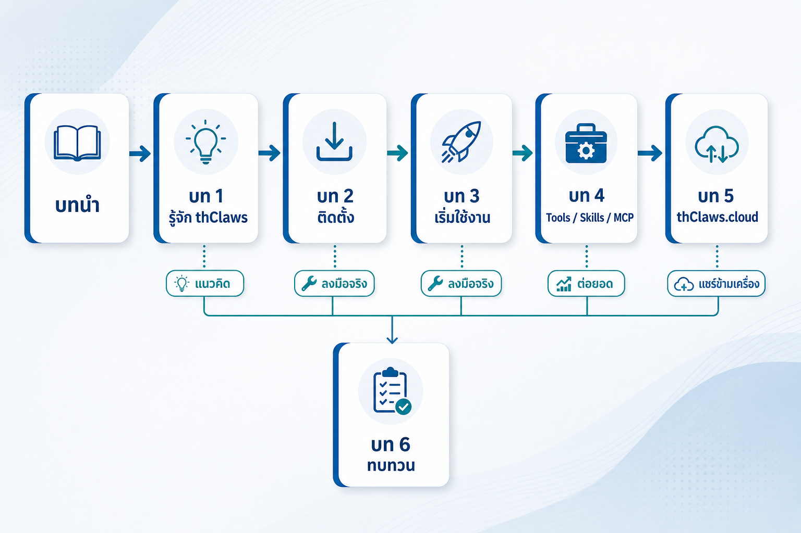
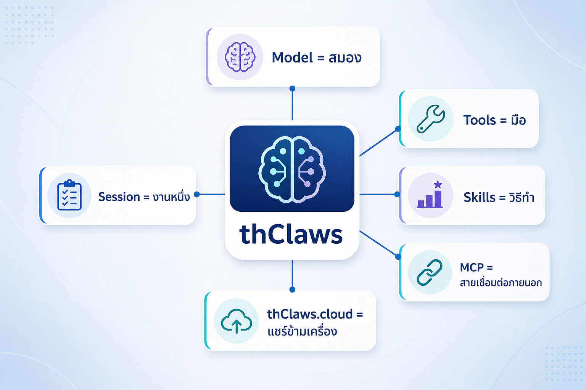

# บทนำ — แนะนำหนังสือ วิธีอ่าน และสิ่งที่ต้องมีก่อนเริ่ม

> ⏱ อ่านประมาณ 10 นาที (ไม่ต้องใช้คอมพิวเตอร์ก็ได้)\
> 🎯 เป้าหมายบทนี้: คุณรู้ว่าหนังสือเล่มนี้สอนอะไร อ่านอย่างไร ต้องเตรียมอะไรบ้าง และจะรู้อะไรเมื่ออ่านจบ

---

## 1. หนังสือเล่มนี้เหมาะกับใคร

หนังสือเล่มนี้ตั้งใจเขียนให้คนที่**ไม่ใช่นักพัฒนา**แต่ทำงานออฟฟิศใช้เครื่องคอมพิวเตอร์เป็นประจำ และเคยใช้ Chat AI แบบถาม-ตอบมาแล้ว (เช่น ChatGPT, Copilot, Gemini)

คุณไม่จำเป็นต้องมีประสบการณ์เหล่านี้มาก่อน:

- ไม่เคยใช้ AI Agent มาก่อน
- ไม่เคยเขียนโค้ด / ใช้ terminal เป็นอาชีพ
- ไม่เคยเข้าใจคำว่า Tools, Skills, MCP ล่วงหน้า

สิ่งที่คุณควรมีแล้ว:

- ใช้คอมพิวเตอร์และเบราว์เซอร์ได้คล่อง
- เคยพิมพ์คำถามให้ Chat AI ตอบได้
- สามารถติดตั้งซอฟต์แวร์ใหม่บนเครื่องตัวเองได้ (ถ้าเป็นเครื่องบริษัท ให้เช็กนโยบายไอทีก่อน — ดูบทที่ 2)

---

## 2. "หนังสือฉบับอ่านเอง" ต่างจากคอร์สอบรมอย่างไร

หนังสือเล่มนี้ดัดแปลงมาจากคอร์ส "เรียนลัด thClaws ใน 2 ชั่วโมง" ซึ่งเดิมมีผู้สอนบรรยายและสาธิตให้ดู

ฉบับนี้**ตัดส่วนที่ต้องมีคนบรรยาย/สาธิตออก** แล้วเปลี่ยนเป็นสิ่งที่คุณทำเองได้คนเดียว:

| เดิมในคอร์ส (มีผู้สอน) | เล่มนี้ (อ่านเอง) |
| --- | --- |
| ผู้สอนบรรยายให้ฟัง | เนื้อหาเขียนเป็นบทความที่อ่านเอง |
| ผู้สอนสาธิตมีขั้นตอน | กิจกรรม "ลงมือทำเอง" ที่คุณเป็นคนทำ พร้อมขั้นตอนทีละขั้น |
| ผู้สอนถามคำถามในคลาส | ส่วน "ตรวจความเข้าใจ" พร้อมเฉลยให้ดูเอง |
| ผู้สอนช่วยแก้ปัญหา | ตาราง "ปัญหาที่พบบ่อย + วิธีแก้" ในทุกบท |
| ตารางเวลาคลาส | แจ้ง "เวลาประมาณ" ต่อบท เพื่อให้คุณจัดเวลาเอง |

โครงสร้างของทุกบท (บทที่ 1 ขึ้นไป) เป็นแบบเดียวกัน เพื่อให้คุณรู้ว่าห้ามพลาดอะไร:

1. **สิ่งที่คุณจะได้จากบทนี้** — เป้าหมายและสิ่งที่ต้องรู้หลังจบบท
2. **เนื้อหา** — อธิบายแนวคิด + ตัวอย่าง + ตารางเปรียบเทียบ
3. **ลงมือทำเอง** — กิจกรรมให้ทำตามด้วยตัวเอง (ทำจริงบนเครื่อง)
4. **ตรวจความเข้าใจ** — คำถามสั้นๆ พร้อมคำตอบ ให้เช็คว่าเข้าใจจริง
5. **ปัญหาที่พบบ่อย** — อาการ + สาเหตุ + วิธีแก้
6. **สรุปบท** — ใจความสำคัญที่ต้องจำ

> 💡 **วิธีอ่านที่ได้ผล:** อ่านเนื้อหา → ปิดหน้าจอ → ทำ "ลงมือทำเอง" จริง → เปิด "ตรวจความเข้าใจ" ตรวจเอง → ผ่านค่อยขึ้นบทถัดไป อย่าข้ามบทที่ 2–3 เพราะเป็นฐานของบทที่ 4–5

---

## 3. เส้นทางการอ่านทั้งเล่ม (แผนที่)

```
บทนำ  →  เตรียมเครื่อง/บัญชี
   ↓
บท 1  รู้จัก thClaws และเข้าใจว่า "Agent" ต่างจาก "Chat" อย่างไร (เนื้อหา)
   ↓
บท 2  ติดตั้ง + ตั้งค่าให้พร้อมใช้จริง   ← ลงมือทำกับเครื่อง
   ↓
บท 3  เริ่มใช้งาน: โหมดการทำงาน, session, คำสั่งแรก   ← ช่วงที่สำคัญที่สุด ต้องทำสำเร็จ
   ↓
บท 4  Tools / Skills / MCP  — ของที่ทำให้ "ทำงาน" ได้จริง
   ↓
บท 5  thClaws.cloud  — บริการคลาวด์: คลัง agent + hosted workspace + model gateway
   ↓
บท 6  ทบทวนทั้งหมด + งานปฏิบัติรวม + ตรวจความเข้าใจ + แผนนำไปใช้
```



*รูปที่ 0-1 — เส้นทางการอ่านทั้งเล่ม: รู้จัก → ติดตั้ง → ใช้ → ต่อยอด (Tools/Skills/MCP) → cloud → ทบทวนและวางแผน*

ลองนึกภาพเส้นทางนี้แบบสะสม: บท 1 ให้แนวคิด → บท 2–3 ให้ "เครื่องที่ใช้ได้" → บท 4 ให้ "มือและวิธีทำ" → บท 5 ให้ "บริการคลาวด์ (แชร์/ซิงก์/รันบนคลาวด์)" → บท 6 ให้ "ตรวจภาพรวมและวางแผนใช้จริง"

---

## 4. สิ่งที่ต้องมีก่อนเริ่ม (Checklist)

ตรวจให้ครบก่อนเริ่มบทที่ 1–2 (บางข้อใช้เฉพาะบทหลัง):

- [ ] คอมพิวเตอร์ **macOS / Windows / Linux** (RAM ≥ 8GB แนะนำ, พื้นที่ว่าง ≥ 500MB)

- [ ] อินเทอร์เน็ตสำหรับดาวน์โหลดและเรียก API

- [ ] สิทธิ์ติดตั้งซอฟต์แวร์ใหม่บนเครื่อง (กรณีเครื่องบริษัท — ถ้าไม่ได้ ดูทางเลือกในบทที่ 2 §9)

- [ ] (ใช้ในบท 2) บัญชี DashScope เพื่อสร้าง **Qwen API Key** (`dashscope.console.aliyun.com`)

- [ ] (ใช้ในบท 5) บัญชี **thClaws.cloud** + Access Key `thc_…` — ปัจจุบันเป็น close-beta ต้องติดต่อ admin ขอ invite

- [ ] (ใช้ในบท 3 เป็นต้นไป) โฟลเดอร์ทำงานส่วนตัว เช่น `~/thclaws-2hr`

> 💡 ไม่ต้องกังวลว่าวิชา "ติดตั้ง" จะยาก — บทที่ 2 จะพาไปทีละขั้นตอนสำหรับทั้ง 3 ระบบปฏิบัติการ คุณเลือกทำแค่ระบบของคุณตัวเดียวก็พอ

---

## 5. เวลา: ใช้เวลาเท่าไหร่ต่อบท

| บท | เวลาอ่านเนื้อหา | \+ เวลาลงมือทำ |
| --- | --- | --- |
| บท 1 | 15 นาที | \~5 นาที (คิดวิเคราะห์) |
| บท 2 | 20 นาที | \~15–30 นาที (ติดตั้งจริง) |
| บท 3 | 20 นาที | \~20 นาที |
| บท 4 | 25 นาที | \~15–20 นาที |
| บท 5 | 15 นาที | \~10 นาที |
| บท 6 | 15 นาที | \~30 นาที (งานรวม) |

รวมทั้งหมดประมาณ **2–3 ชั่วโมง** ขึ้นกับว่าคุณทำกิจกรรมครบหรือไม่ และเครื่องติดตั้งราบรื่นแค่ไหน

> ถ้าเวลาจำกัด: ควรลงทุนเวลาให้เต็มกับ **บท 2 และบท 3** เพราะเป็นจุดที่ทำให้คุณ "รัน thClaws ได้จริง" — ถ้าตรงนี้ผ่าน ส่วนที่เหลือจะต่อยอดง่าย

---

## 6. แหล่งอ้างอิง (ใช้เมื่ออยากรู้ลึก)

หนังสือเล่มนี้เรียบเรียงจากคู่มือทางการของ thClaws ชื่อ `user-manual-th` ซึ่งมีอยู่ในโปรเจกต์ GitHub `thClaws/thClaws` (โฟลเดอร์ `user-manual-th`) บทที่หนังสือเล่มนี้ใช้:

| เรื่อง | บทในคู่มือ |
| --- | --- |
| thClaws คืออะไร / ต่างจาก Chat | `ch01-what-is-thclaws.md` |
| การติดตั้ง | `ch02-installation.md` |
| working directory + 3 โหมด | `ch03-working-directory-and-modes.md` |
| Desktop GUI tour | `ch04-desktop-gui-tour.md` |
| Permissions / การตั้งค่า | `ch05-permissions.md`, `ch06-providers-models-api-keys.md` |
| Session | `ch07-sessions.md` |
| Instruction (global/folder) | `ch08-memory-and-agents-md.md` |
| คำสั่งแรก / Slash commands | `ch10-slash-commands.md` |
| Built-in tools | `ch11-built-in-tools.md` |
| Skills | `ch12-skills.md` |
| MCP | `ch14-mcp.md` |
| Agent Team (optional feature) | `ch17-agent-teams.md` |
| thClaws.cloud | `ch27-thclaws-cloud.md` |

> ⚠️ **หมายเหตุความแม่นยำ:** คำสั่ง ตัวเลข และ URL ในหนังสือเล่มนี้เป็นไปตามคู่มืออ้างอิง ณ เวลาที่เขียน เนื่องจากซอฟต์แวร์มีการพัฒนาต่อเนื่อง ควรเทียบกับคู่มืออ้างอิงอีกครั้งก่อนนำไปใช้กับงานจริง

---

## 7. สิ่งที่คุณจะได้เมื่ออ่านจบทั้งเล่ม

เมื่อทำครบทั้ง 6 บท คุณจะ:

- อธิบายได้ว่า thClaws ต่างจาก Chat AI อย่างไร (แทนที่จะใช้เหมือน Chat AI แล้วผิดหวัง)
- มี thClaws ที่ติดตั้งและตั้งค่าเรียบร้อยบนเครื่องตัวเอง
- ส่งคำสั่งแรกได้จริง และสร้างไฟล์ได้จริง
- ใช้ built-in tools ได้, รู้จัก Skill และ MCP
- ตั้งค่า thClaws.cloud (Access Key) และรู้ว่าใช้ทำอะไร
- มีแผนงานประจำวัน 1 อย่างที่อยากให้ thClaws ช่วย



*รูปที่ 0-2 — ภาพรวม "ของที่ทำให้ thClaws ต่าง": Model / Tools / Skills / MCP / Session / cloud*

พร้อมแล้วหรือยัง? ขึ้นบทที่ 1 กันเลย — รู้จัก thClaws ว่าคืออะไร และทำไมถึงต่างจาก Chat AI ที่คุณเคยใช้