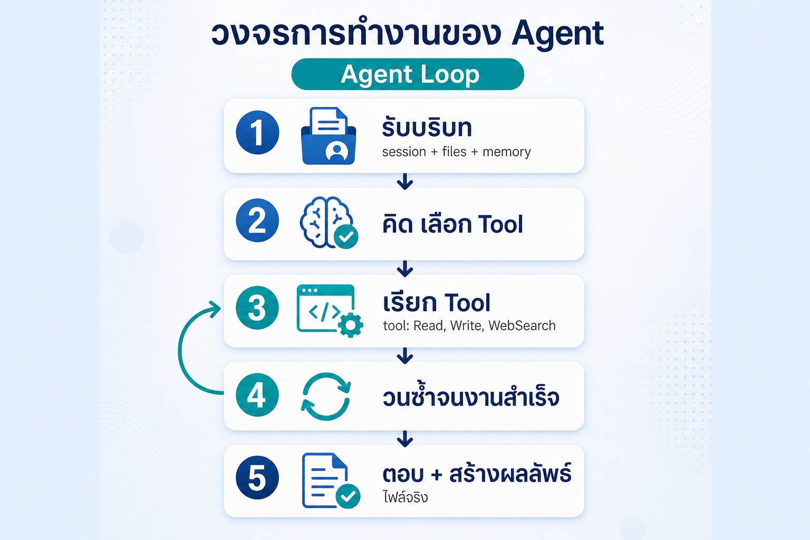
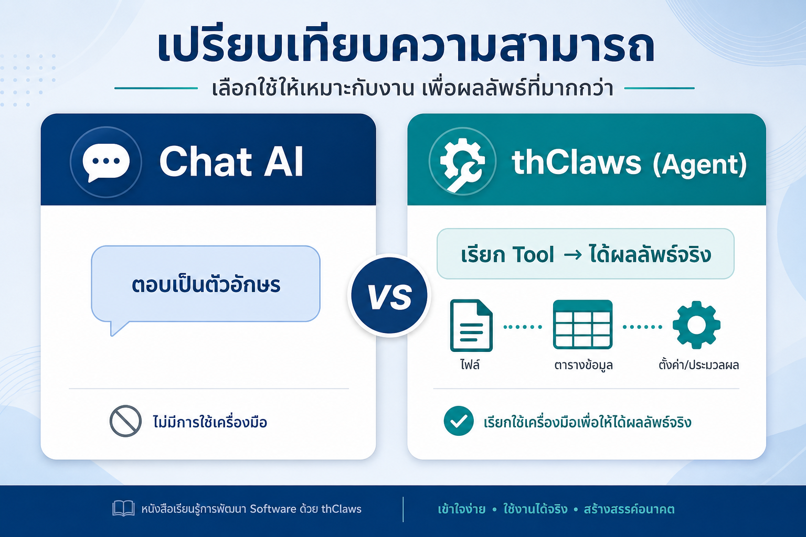
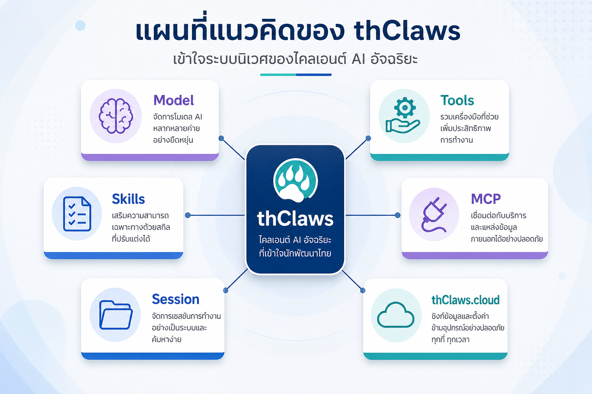

# บทที่ 1 — thClaws คืออะไร และต่างจาก Chat AI อย่างไร

> ⏱ อ่าน ~15 นาที + คิดวิเคราะห์ ~5 นาที
> 🎯 เป้าหมายบทนี้: เข้าใจว่า thClaws / AI Agent คืออะไร ทำไมถึง "ทำงานได้" ไม่ใช่แค่ตอบ และตั้งความคาดหวังให้ถูกก่อนใช้งานจริง

---

## สิ่งที่คุณจะได้จากบทนี้

- อธิบายได้ว่า thClaws คืออะไร (ในประโยคง่ายๆ)
- แยกแยะได้ว่า AI Agent "ทำงาน" ต่างจาก Chat AI "ตอบ" อย่างไร
- เข้าใจคำว่า local-first และ folder = agent
- รู้จัก "ของที่ทำให้ thClaws ต่างจาก Chat" ทั้งหมด (Tools / Skills / MCP / Session / cloud) เพื่อรู้ว่าไปเจออะไรในบทต่อๆ ไป

---

## 1. ทำไมต้องเริ่มจาก "แนวคิด" ก่อน

ถ้าคุณเคยใช้ Chat AI (ChatGPT / Copilot / Gemini) ถาม-ตอบมานาน แนวโน้มอย่างหนึ่งคือคุณจะใช้ thClaws เหมือนพิมพ์คำถามลงในกล่องแชต แล้วคาดหวังผลลัพธ์แบบเดิม

ปัญหาคือ **thClaws ไม่ใช่แค่กล่องแชต** มันเป็นโปรแกรมที่ "ลงมือทำ" ได้ ถ้าคุณไม่ปรับความคาดหวังก่อน คุณจะสั่งงานแล้วผิดหวัง หรือไม่ใช้ความสามารถที่มันมีจริง

บทนี้มีหน้าที่เดียว: **ปรับมุมมองให้เห็นว่าเครื่องมือนี้ทำงานจริง ไม่ใช่แค่คุยด้วย**

---

## 2. thClaws คืออะไร (อธิบายแบบง่าย)

**thClaws คือโปรแกรม AI Agent ที่รันบนเครื่องของคุณ** — เป็น "ผู้ช่วยที่ทำงานจริง" ไม่ใช่แค่คู่สนทนา

| คำถาม | คำตอบ |
|--------|-------|
| ใครใช้ได้ | คนทำงานทั่วไป — ไม่ต้องเขียนโค้ด |
| อยู่ที่ไหน | **บนเครื่องคุณ** (local-first) — ข้อมูลไม่บังคับต้องส่งขึ้น cloud |
| ทำอะไรได้ | อ่าน/สร้างไฟล์, รันเครื่องมือ, ทำเอกสาร/สเปรดชีต/สไลด์, ต่อกับบริการภายนอก, ทำงานตามกำหนด |
| ใช้ยังไง | พิมพ์คำสั่งเป็นภาษาไทยหรืออังกฤษ เหมือนแชต — แต่สั่งให้ "ทำงาน" ได้ |

> 🔑 **ประโยคแกนของทั้งเล่ม:** *"Chat AI ตอบคำถาม / thClaws ทำงานให้"*

---

## 3. AI Agent ต่างจาก Chat AI อย่างไร (หัวใจของบทนี้)

### 3.1 ดูจากกลไกการทำงาน (Agent Loop)

เมื่อคุณพิมพ์คำสั่งลงใน thClaws สิ่งที่เกิดขึ้นข้างหลังมีหลายขั้น ไม่ใช่แค่ "จับข้อความ → ตอบ":

```
คุณพิมพ์คำสั่ง
   ↓
[1] Agent รับบริบท  (session + ไฟล์ในเครื่อง + ความจำ)
   ↓
[2] Agent "คิด" และเลือกเครื่องมือ (Tool) ที่ต้องใช้
   ↓
[3] เรียก Tool → ได้ผลลัพธ์กลับมา
   ↓
[4] วนซ้ำจนกว่างานจะสำเร็จ
   ↓
[5] ตอบคุณ + สร้างไฟล์ / ผลลัพธ์จริง
```



*รูปที่ 1-1 — วงจรการทำงานของ Agent (Agent Loop): รับบริบท → คิด/เลือก Tool → เรียก Tool → วนซ้ำ → ตอบ + สร้างผลลัพธ์*

ขั้น [3]–[4] คือสิ่งที่ Chat AI ทั่วไปไม่มี มันไม่ใช่แค่ "คิดและพิมพ์ตอบ" แต่**เรียกใช้เครื่องมือจริง วนซ้ำได้ จนได้ผลลัพธ์เป็นไฟล์หรืองานจริง**

### 3.2 เทียบกันเป็นตาราง

| ขั้น | Chat AI | thClaws (Agent) |
|------|---------|------------------|
| รับบริบท | แค่ข้อความที่พิมพ์ | Session + **อ่านไฟล์ในเครื่อง** + ความจำ |
| ลงมือ | ตอบเป็นตัวอักษร | **เรียก Tool** (อ่าน/เขียนไฟล์, รันคำสั่ง, งานเอกสาร…) |
| วนซ้ำ | ไม่มี | ทำงาน **หลายขั้นเอง** จนจบ |
| ผลลัพธ์ | ข้อความ | **ไฟล์จริง / งานจริง / การกระทำ** |



*รูปที่ 1-2 — เปรียบเทียบ Chat AI vs thClaws: Chat ตอบเป็นตัวอักษร / Agent เรียก Tool แล้วได้ผลลัพธ์จริง*

> 🗣️ **อุปมาที่ช่วยจำ:** *Chat = "พนักงานที่อธิบายวิธีทำงานให้ฟัง" / Agent = "พนักงานที่ลงมือทำงานให้ แล้วส่งงานจริง"*


*รูปที่ 1-4 — อุปมา "Chat ตอบ / Agent ทำงาน" *(ภาพประกอบเชิงอุปมา ไม่บังคับ)***

---

## 4. ทำไม thClaws ถึงเป็น "local-first" และสำคัญอย่างไร

- ตัวโปรแกรมพร้อมการตั้งค่าอยู่บนเครื่องของคุณ (เก็บในโฟลเดอร์ `.thclaws/` ของ working directory)
- **folder = agent** — โฟลเดอร์ทำงานหนึ่งๆ คือ "ผู้ช่วยหนึ่งตัว" ที่มีคำสั่ง (instruction) และข้อมูลของตัวเอง
- ข้อมูลอยู่บนเครื่องของคุณ; ส่วนการเลือกตัวโมเดล (เช่น Qwen) ขึ้นกับ**ความสามารถของโมเดล**ที่ตรงกับงาน — ไม่ใช่เรื่อง "ข้อมูลลับหรือไม่" (รายละเอียดในบทที่ 2)

---

## 5. สรุป "ของที่ทำให้ thClaws ต่าง" (ภาพรวมทั้งเล่ม)

เพื่อให้คุณเห็นแผนที่ก่อนเข้าบทถัดไป — ปัจจุบันที่ทำให้ thClaws "ทำงานได้จริง" ประกอบด้วย:

| ของ | บทบาท | เรียนในบท |
|-----|--------|-----------|
| **Model** | สมอง AI (เช่น Qwen/DashScope) | บท 2 |
| **Tools** | มือ/เครื่องมือในตัว (อ่าน/เขียนไฟล์, เอกสาร, เว็บ) | บท 4 |
| **Skills** | วิธีทำงานแบบสำเร็จรูป เรียกใช้ซ้ำได้ | บท 4 |
| **MCP** | สายเชื่อมต่อบริการภายนอก (Drive, GitHub, DB) | บท 4 |
| **Session** | งานหนึ่งๆ แยกแต่ละเรื่องออกจากกัน | บท 3 |
| **thClaws.cloud** | บริการคลาวด์: คลัง agent + hosted workspace + model gateway | บท 5 |



*รูปที่ 1-3 — "ของที่ทำให้ thClaws ต่าง": Model = สมอง, Tools = มือ, Skills = วิธีทำ, MCP = สายเชื่อมต่อภายนอก, Session = งาน, cloud = บริการคลาวด์ (แชร์/ซิงก์/รันบนคลาวด์)*

> 🔑 **สูตรจำ:** *Tools = มือ / Skills = วิธีทำ / MCP = สายเชื่อมต่อภายนอก / Session = งานหนึ่ง*

---

## ลงมือทำเอง (คิดวิเคราะห์ ~5 นาที)

**โจทย์:** เลือก**งานซ้ำ** 1 อย่างที่คุณทำในที่ทำงานจริง (เช่น สรุปใบเสนอราคา, เก็บรวบรวมข้อมูล, ทำรายงานประจำสัปดาห์) แล้วตอบ 3 ข้อนี้ลงในสมุด:

1. งานนั้นมีขั้นตอนอะไรบ้าง? เขียน 3–5 ขั้น
2. ถ้าให้ thClaws ทำ มันต้องมี "มือ" (= Tool) อะไรบ้าง? (เช่น อ่านไฟล์ PDF, สร้างตาราง Excel, ค้นข้อมูลในเว็บ — ลองเดาได้เลย ยังไม่ต้องแม่น)
3. งานนี้ต้องการโมเดลแบบไหน: เร็ว/คุ้มค่า หรือคุณภาพสูง? เพราะอะไร?

> 💡 งานที่คุณเลือกในข้อนี้คือ **ฐานของทั้งเล่ม** — แต่ละขั้นที่คุณเขียนจะกลายเป็น workflow ที่คุณใช้ Tools/Skills จริงในบทที่ 4

---

## ตรวจความเข้าใจ (เช็กก่อนขึ้นบทถัดไป)

ลองตอบเองก่อน แล้วดูเฉลยใต้เส้นประ:

**1.** ข้อใดคือความต่างหลักระหว่าง Chat AI กับ thClaws (AI Agent)?
- ก. Chat ใช้ภาษาเดียว ส่วน thClaws ใช้หลายภาษา
- ข. Chat ตอบเป็นข้อความ ส่วน Agent ลงมือทำงานผ่านเครื่องมือ (Tools) จนได้ผลลัพธ์จริง
- ค. Chat ฟรีเสมอ ส่วน thClaws ต้องจ่ายเสมอ
- ง. ไม่ต่างกัน

**2.** "local-first" หมายถึงอะไร?
- ก. thClaws ใช้ได้เฉพาะเครื่องเดียว
- ข. โปรแกรมและการตั้งค่าอยู่บนเครื่องของคุณ (folder = agent)
- ค. ต้องต่ออินเทอร์เน็ตตลอดเวลา
- ง. ใช้ได้เฉพาะภาษาท้องถิ่น

**3.** "folder = agent" แปลว่าอะไร?
- ก. แต่ละโฟลเดอร์ทำงาน = ผู้ช่วย (agent) หนึ่งตัวที่มีตัวตน/คำสั่งของตัวเอง
- ข. ต้องสร้างโฟลเดอร์ก่อนทุกครั้ง
- ค. agent เก็บเฉพาะรูปภาพ
- ง. ไม่เกี่ยวข้องกับโฟลเดอร์

---

<details><summary>เฉลย</summary>

- **ข้อ 1:** ข — Chat ตอบเป็นข้อความ / Agent ลงมือผ่าน tools จนได้ผลลัพธ์จริง
- **ข้อ 2:** ข — local-first = โปรแกรมและการตั้งค่าอยู่บนเครื่องคุณ (folder = agent)
- **ข้อ 3:** ก — โฟลเดอร์ทำงานหนึ่ง = agent หนึ่งตัวที่มี AGENTS.md (ตัวตน/คำสั่ง) ของตัวเอง

ผ่านทุกข้อ → ขึ้นบทที่ 2 ได้เลย

</details>

---

## ปัญหาที่พบบ่อย / คำถามที่คนมักสงสัย

| คำถาม | คำตอบ |
|--------|-------|
| "thClaws ใช้แทน ChatGPT ได้เลยไหม" | ได้สำหรับงานที่ "ลงมือ" (สร้างไฟล์/ทำงาน) แต่ต้องติดตั้งและตั้งค่าก่อน — ไม่ใช่แค่เว็บแชตที่เปิดแล้วถามได้ทันที |
| "ผมไม่เขียนโค้ด ใช้ได้ไหม" | ได้ — ใช้คำสั่งภาษาไทยเหมือนแชต แต่เน้นออกคำสั่งให้ชัดเจน |
| "ปลอดภัยไหม ข้อมูลไปไหน" | เป็น local-first ข้อมูลอยู่บนเครื่องคุณ; การเลือกโมเดลขึ้นกับความสามารถไม่ใช่ความลับ (ดูบท 2) |
| "ต้องรู้ Skill/Tool/MCP ก่อนไหม" | ไม่ — หนังสือเล่มนี้จะพาใช้จริงทีละอย่างในบท 4 |

**ข้อควรระวังที่คนเริ่มต้นมักทำ:**
- ❌ คิดว่า thClaws เป็นแค่ Chat AI ตัวใหม่ → จะพลาดความสามารถจริง
- ❌ ตั้งความคาดหวังว่าสั่งมั่วๆ ได้ → จริงต้องสั่งให้ชัดเจน และ**ตรวจผลลัพธ์เสมอ** (AI ยังมีข้อมูลลวง)

---

## สรุปบท

| หัวข้อ | สาระที่ต้องจำ |
|--------|--------------|
| thClaws คืออะไร | AI Agent แบบ local-first ที่ "ทำงาน" บนเครื่องคุณ |
| Chat vs Agent | Chat ตอบ / Agent ลงมือ (มี Tools + ความจำ + การวนซ้ำ) |
| Local-first | ข้อมูลและการตั้งค่าอยู่บนเครื่อง; folder = agent |
| ของที่ทำให้ต่าง | Tools / Skills / MCP / Session / cloud |
| ข้อควรจำ | สั่งให้ชัด + ตรวจผลลัพธ์เสมอ |

> **ประโยคส่งต่อ:** เข้าใจแนวคิดแล้ว ถึงเวลาจับมือจริง — บทที่ 2 จะพาคุณติดตั้งและตั้งค่าให้พร้อมใช้