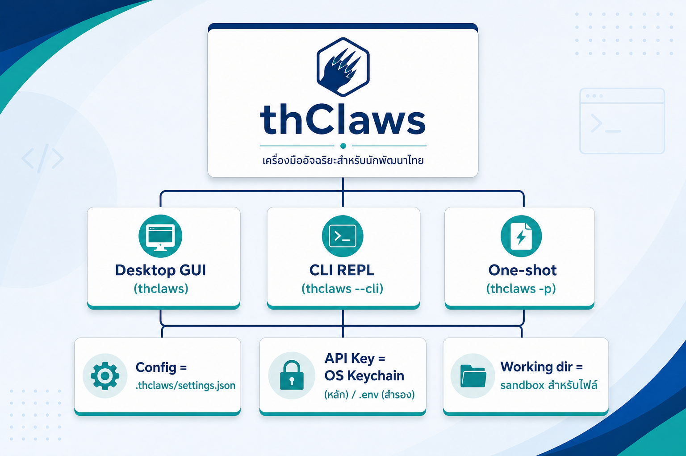
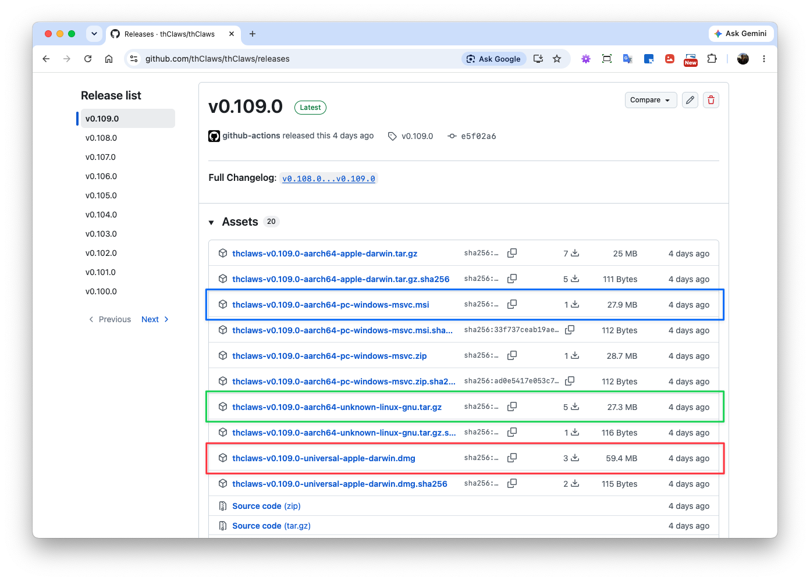
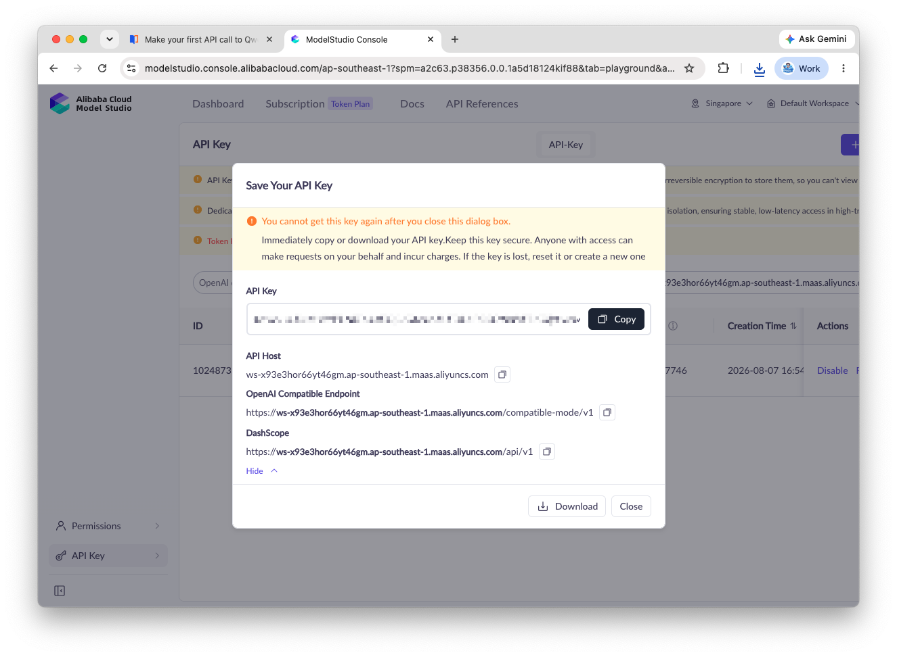
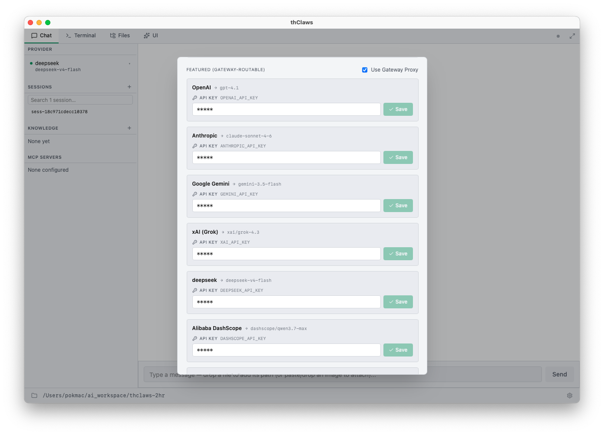
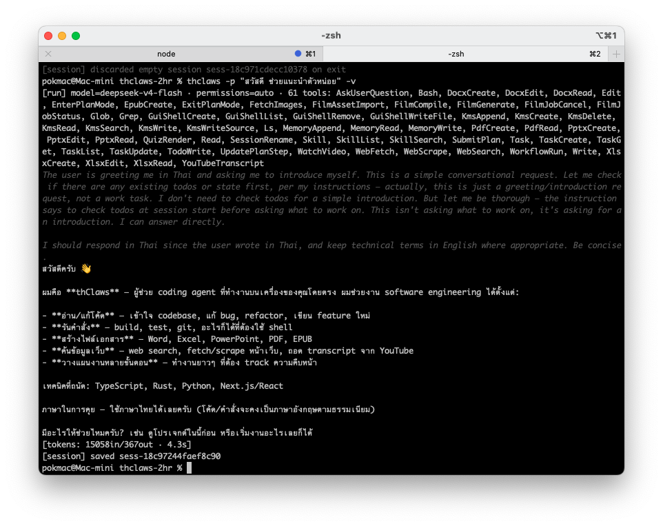
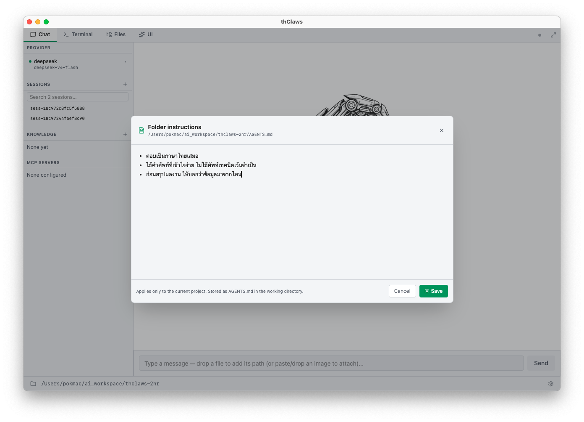
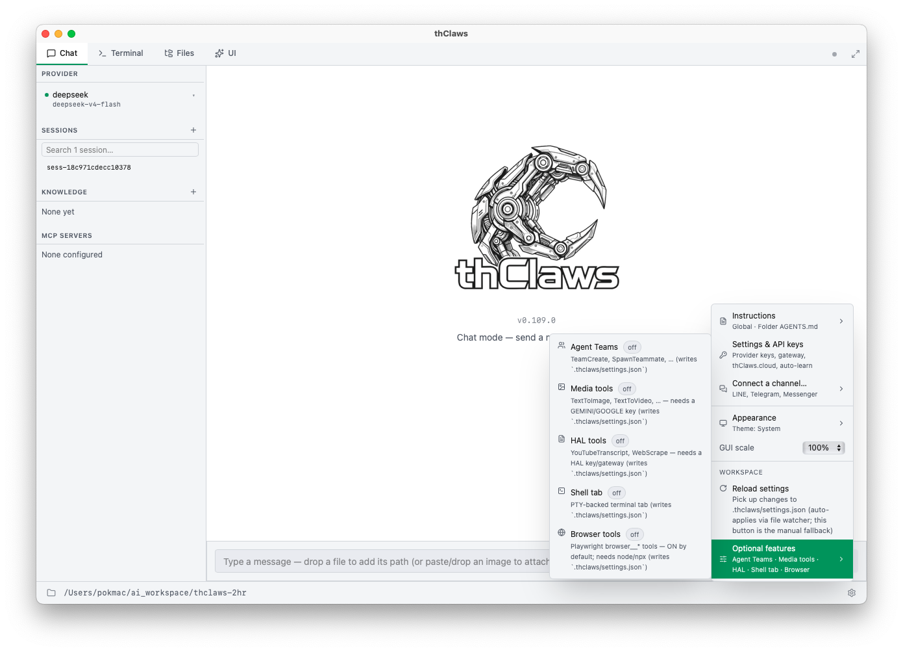

# บทที่ 2 — ติดตั้งและตั้งค่าให้พร้อมใช้ (DashScope / Qwen)

> ⏱ อ่าน ~20 นาที + ลงมือติดตั้งจริง ~15–30 นาที
> 🎯 เป้าหมายบทนี้: thClaws รันบนเครื่องคุณได้จริง, ใส่ Qwen API Key ได้, ตั้ง instruction ไฟล์แรกได้ — **ให้ "รันได้ก่อน" เนื้อหาทฤษฎีค่อยตาม**

---

## สิ่งที่คุณจะได้จากบทนี้

- ติดตั้ง thClaws Desktop บนเครื่องคุณสำเร็จ (เลือกวิธีตามระบบปฏิบัติการของคุณ แค่ระบบเดียว)
- สร้างและใส่ Qwen API Key (จาก DashScope) ได้
- ตั้ง instruction ไฟล์แรก (AGENTS.md) ที่กำหนด "ตัวตนผู้ช่วย"
- รู้จักฟีเจอร์เสริม (optional features) ที่เปิดได้ตามงาน
- แก้ปัญหาที่พบบ่อยตอนติดตั้ง/ตั้งค่ายืนได้เอง

---

## 1. ทำไมบทนี้ต้องทำก่อนบทอื่น

หนังสือเล่มนี้เป็นแนวปฏิบัติ (hands-on) — ทุกบทถัดไปต้อง "ลองทำบนเครื่องตัวเอง" ถ้าติดตั้งไม่เสร็จบทนี้ คุณจะตามเนื้อหาบทที่ 3–5 ไม่ทัน

หลักการของบทนี้: **ให้ทุกคนรันได้ก่อน เนื้อหาทฤษฎีค่อยตาม** — อย่าฝืนอ่านทั้งบทถ้าติดอยู่ขั้นไหน ให้ข้ามไปที่ตารางแก้ปัญหา (§9) ก่อน

---

## 2. สถาปัตยกรรมที่ต้องจำ (3 ตำแหน่ง)

ก่อนติดตั้ง ขอให้จำ**โครงสร้าง 3 ส่วน**นี้ไว้ — จะเห็นมันซ้ำในบท 3–5:

```
คุณ
 ├── thClaws (โปรแกรมตัวเดียว)
 │     ├── Desktop GUI  →  thclaws
 │     ├── CLI REPL     →  thclaws --cli
 │     └── One-shot     →  thclaws -p "…"
 ├── Config            →  .thclaws/settings.json
 ├── API Key           →  OS Keychain (หลัก) / .env (สำรอง)
 └── Working dir       →  sandbox สำหรับไฟล์ทำงาน
```



*รูปที่ 2-1 — สถาปัตยกรรม 3 ตำแหน่งที่ต้องจำ: โปรแกรมเดียว (GUI/CLI/One-shot) + settings.json + Keychain + working directory*

> 🔑 **จำ 3 ไฟล์/ตำแหน่ง:** `settings.json` (การตั้งค่า) · **Keychain** (เก็บ Key) · **working directory** (ไฟล์งาน)
> หมายเหตุ: ทั้ง 3 รูปแบบ (GUI/CLI/One-shot) มาจาก**โปรแกรมตัวเดียว** ใช้ backend และ working directory ร่วมกัน — จะเห็นภาพเต็มในบทที่ 3

---

## 3. ตรวจความพร้อมของเครื่องก่อนติดตั้ง (~2 นาที)

เปิด Terminal (macOS/Linux) หรือ PowerShell (Windows) แล้วรัน:

```bash
uname -m          # macOS/Linux → arm64 หรือ x86_64  (Windows: $env:PROCESSOR_ARCHITECTURE)
df -h ~           # ดูพื้นที่ว่าง — ควร ≥ 500MB
curl -sI https://thclaws.ai | head -1   # เช็กเน็ต — ควรเห็น HTTP 200
```

- แรม (RAM) ≥ 8GB แนะนำ
- เช็กว่าติดตั้งซอฟต์แวร์ใหม่บนเครื่องได้ (ถ้าเป็นเครื่องบริษัทมีนโยบายห้าม → ใช้วิธี Docker หรือ Portable ดู §9)

---

## 4. ติดตั้ง thClaws Desktop (เลือกตามระบบของคุณ)

> ดาวน์โหลดเวอร์ชันล่าสุดจาก **GitHub Releases** ของ thClaws (`https://github.com/thClaws/thClaws/releases`) — เลือกไฟล์ตามระบบของคุณด้านล่าง


> 📷 **รูปที่ 2-2 — หน้าดาวน์โหลด GitHub Releases** *(screenshot: ถ่ายจากหน้าจอจริง — ไฮไลต์ไฟล์ .dmg / .msi / tarball ตาม OS*

### macOS (ไฟล์ `.dmg` แบบ universal — รองรับ Apple Silicon และ Intel)

```bash
curl -L -o thclaws.dmg <ลิงก์ ...-universal-apple-darwin.dmg>
open thclaws.dmg
# ลาก thClaws เข้า Applications → เปิดครั้งแรก คลิกขวา → Open (ถ้า Gatekeeper กัน)
```

> 💡 ถ้าเปิดครั้งแรกแล้ว macOS เตือน "ไม่มาจาก App Store" → คลิกขวาที่ไอคอน → **Open** → กด **Open** อีกครั้ง (ดู §9)

### Windows (ไฟล์ `.msi` — per-user, ตั้ง PATH ให้อัตโนมัติ, ไม่ต้อง admin)

```powershell
# สำหรับ x86_64 (ปกติ)
iwr -Uri <ลิงก์ ...-x86_64-pc-windows-msvc.msi> -OutFile thclaws.msi
Start-Process msiexec.exe -ArgumentList '/i', 'thclaws.msi' -Wait

# สำหรับ ARM (Surface Pro X / Snapdragon) → ใช้ไฟล์ ...-aarch64-pc-windows-msvc.msi
```

### Linux (ไฟล์ tarball)

```bash
curl -L <ลิงก์ ...-x86_64-unknown-linux-gnu.tar.gz> | tar -xz && sudo mv thclaws /usr/local/bin/
# สำหรับ aarch64 → ใช้ไฟล์ ...-aarch64-unknown-linux-gnu.tar.gz
```

### ตรวจว่าติดตั้งสำเร็จ

```bash
thclaws --version     # ควรเห็น "thclaws v0.<ล่าสุด>" — เช็กเลขจริงจาก GitHub Releases
```

> 💡 ไม่ต้องลองทุกวิธี — เลือกวิธีเดียวที่ดูแลง่ายที่สุดสำหรับคุณ (คนทำงานออฟฟิศส่วนใหญ่ใช้ GUI เป็นหลัก)

---

## 5. สร้างโฟลเดอร์ทำงาน (Working Directory)

```bash
mkdir -p ~/thclaws-2hr && cd ~/thclaws-2hr
```

> 🔑 thClaws จะ **sandbox file tools ไว้ที่ working directory** — วางไฟล์งานทั้งหมดไว้ในนี้ เพื่อให้ Agent "เห็นและจัดการได้" อย่างปลอดภัย จำไว้ว่า "cd ไปที่ไหน = เปิดผู้ช่วยที่ทำงานในโฟลเดอร์นั้น" (รายละเอียดบท 3)

---

## 6. สร้าง Qwen API Key (DashScope) — ทีละขั้น

1. ไปที่ **DashScope Console**: `https://dashscope.console.aliyun.com/`
2. ล็อกอินด้วยบัญชี Alibaba Cloud (ไม่มี → สมัครฟรีได้)
3. เมนู **API-KEY** (ซ้ายมือ) → **Create new API-KEY**
4. ระบบสร้าง Key ขึ้นต้น `sk-` → **คัดลอกเก็บทันที** (แสดงครั้งเดียว)
5. (แนะนำ) เปิดใช้/activate โมเดล Qwen ที่ต้องการในหน้า Model



> 📷 **รูปที่ 2-3 — หน้าสร้าง Qwen API Key บน DashScope** *(screenshot: DashScope Console → API-KEY → Create new API-KEY — ชี้ Key ขึ้นต้น sk- — แทรกทีหลัง)*

> ⚠️ **Key แสดงครั้งเดียว** — หลังสร้างแล้วต้องคัดลอกเก็บทันที ถ้าเก็บไม่ทันให้สร้างใหม่ อย่าฝัง Key ในโค้ดหรือโพสต์แชร์

---

## 7. ใส่ Key ใน thClaws

**ผ่าน GUI:** เปิด thClaws → **⚙ Settings** → Provider: **DashScope/Qwen** → วาง Key → Save



> 📷 **รูปที่ 2-4 — หน้าตั้งค่า Provider DashScope/Qwen ใน thClaws** *(screenshot: หน้าจอ Settings → Provider — ชี้ช่องวาง Key และปุ่ม Save)*

**ผ่าน CLI:**
```bash
thclaws --cli
> /provider dashscope
> /model qwen-plus
```

> 🔐 Key เก็บใน **OS Keychain** อัตโนมัติ (ไม่ฝังใน config) — ปลอดภัยกว่า; ไฟล์ `.env` เป็นตัวสำรองสำหรับงาน automation

**ทดสอบว่าสำเร็จ:**
```bash
thclaws -p "สวัสดี ช่วยแนะนำตัวหน่อย" -v
```



> 📷 **รูปที่ 2-5 — ผลลัพธ์จากคำสั่งทดสอบ** *(screenshot: หน้าต่างเทอร์มินัลแสดงคำตอบของ Agent)*

- ✅ ได้คำตอบ = พร้อมใช้ → ขึ้นบท 3 ได้เลย
- ❌ มี error → ดู §9 Troubleshooting

---

## 8. ตั้งค่าเพิ่มเติม: เลือกโมเดล + instruction + ฟีเจอร์เสริม

### 8.1 เลือกโมเดลตามความสามารถ (ไม่ใช่ตามระดับความลับ)

> ✅ **หลักสำคัญ:** การเลือก model ขึ้นกับ **คุณสมบัติ/ความสามารถ** ของแต่ละตัวว่ารองรับงานแบบไหน — **ไม่ได้**ขึ้นกับว่าข้อมูลลับหรือไม่

| ตัวเลือก | ความสามารถหลัก | เหมาะกับ |
|---------|----------------|----------|
| `qwen-turbo` | เร็ว, คุ้มค่า | งานทั่วไปที่อยากได้ไว, ราคาถูก |
| `qwen-plus` | สมดุล เร็ว + คุณภาพ | งานประจำวันทั่วไป |
| `qwen-max` | คุณภาพสูงสุด | งานซับซ้อน ต้องละเอียด/แม่นยำ |
| Ollama (local) | รันในเครื่อง ไม่ใช้เน็ต | งาน offline / ไม่พึ่ง Key |
| โมเดลภาพ/วิดีโอ | สร้าง-แก้ภาพ/วิดีโอ | งานคอนเทนต์/สื่อ |

**วิธีสลับโมเดล:**
```bash
> /model qwen-plus      # สลับไปโมเดลที่เหมาะกับงาน
> /model qwen-max       # งานยาก ใช้คุณภาพสูง
```

> ก่อนเลือกโมเดล ให้ถามตัวเองว่า **"งานนี้ต้องการโมเดลที่เก่งด้านไหน?"** — เร็ว/คุ้มค่า คุณภาพสูง หรือรองรับภาพ วิดีโอ — นี่คือสิ่งที่ใช้เลือก ไม่ใช่ "งานนี้ลับไหม"

### 8.2 Instruction (global / folder)

`instruction` คือ**ชุดคำสั่งที่บอกให้ Agent รู้ตัวตนและวิธีทำงาน** แบ่งเป็น 2 ระดับ:

- **Global** — ใช้กับทุก session (เช่น "ตอบภาษาไทยเสมอ, ใช้ศัพท์ง่าย")
- **Folder** — ใช้เฉพาะในโฟลเดอร์ทำงานนั้น (เช่น "งานนี้เกี่ยวกับเอกสารการขาย")

**วิธีตั้งผ่าน GUI:** Settings → Instruction → ใส่ข้อความ global; และ/หรือสร้างไฟล์ `AGENTS.md` ในโฟลเดอร์ทำงานเพื่อตั้งแบบ folder

ตัวอย่าง instruction ไฟล์แรกของคุณ:
```md
# AGENTS.md
- ตอบเป็นภาษาไทยเสมอ
- ใช้ศัพท์ที่เข้าใจง่าย ไม่ใช้ศัพท์เทคนิคเว้นจำเป็น
- ก่อนสรุปผลงาน ให้บอกว่าข้อมูลไหนมาจากไหน
```



> 📷 **รูปที่ 2-6 — ตัวอย่าง instruction ในหน้า Settings** *(screenshot: หน้าจอ Settings → Instruction พร้อมตัวอย่างคำสั่ง "ตอบภาษาไทยเสมอ")*

> 🔑 instruction ไฟล์แรก = "ร่างตัวตนผู้ช่วย" — มีผลต่อทุกคำสั่งที่ตามมา และเป็นหนึ่งในไฟล์ที่ทำให้ "folder = agent" (บทที่ 5)

### 8.3 ฟีเจอร์เสริม (Optional Features — เปิด/ปิดตามงาน)

| ฟีเจอร์ | ใช้ทำอะไร | เปิดเมื่อ |
|---------|-----------|----------|
| **Agent Team** | ผู้ช่วยหลายตัวทำงานร่วมกัน | งานซับซ้อนหลายส่วน |
| **Media Tools** | สร้าง/แก้ภาพ, วิดีโอ, เสียง | งานสื่อ/คอนเทนต์ |
| **HAL Tools** | อ่านเว็บ / browser | อยากให้ Agent ค้นข้อมูลออนไลน์ |
| **Shell** | รันคำสั่งระบบ | งาน automation ขั้นสูง |
| **Browser** | ควบคุมเบราว์เซอร์ | ใช้เว็บเป็นเครื่องมือ |



> 📷 **รูปที่ 2-7 — หน้าเปิด/ปิดฟีเจอร์เสริม (Optional Features)** *(screenshot: หน้าจอ Settings แสดงสวิตช์ Agent Team / Media / HAL / Shell / Browser)*

> 💡 เปิดเฉพาะที่จำเป็น — ฟีเจอร์มาก = ต้องขอสิทธิ์ (permission) มากตามไปด้วย (ดูบทที่ 3 เรื่อง permission)

---

## ลงมือทำเอง (ทำจริงบนเครื่อง ~15–30 นาที)

ทำตามลำดับ แล้วติ๊กช่องเมื่อผ่าน:

- [ ] ตรวจพร้อมเครื่อง (§3): ระบบ/พื้นที่/เน็ต/สิทธิ์
- [ ] ติดตั้ง thClaws สำเร็จ (อย่างน้อย 1 วิธีตาม §4)
- [ ] `thclaws --version` ทำงาน
- [ ] สร้างโฟลเดอร์ `~/thclaws-2hr` (§5)
- [ ] สร้าง Qwen API Key ที่ DashScope (§6) — Key ขึ้นต้น `sk-…`
- [ ] ใส่ Key ผ่าน GUI หรือ CLI (§7)
- [ ] รัน `thclaws -p "สวัสดี ช่วยแนะนำตัวหน่อย" -v` แล้ว**ได้คำตอบ** ✅ ← กฎแห่งความสำเร็จของบทนี้
- [ ] ตั้ง instruction ไฟล์แรก `AGENTS.md` (§8.2)

> ถ้าข้อ "ได้คำตอบแล้ว" ยังไม่ผ่าน อย่าข้ามไปบท 3 — ใช้ตารางแก้ปัญหาข้างล่างก่อน

---

## ตรวจความเข้าใจ (เช็กก่อนขึ้นบทถัดไป)

**1.** Qwen API Key ควรเก็บไว้ที่ไหน?
- ก. ฝังในโค้ด/ไฟล์ config โดยตรง
- ข. เก็บใน OS Keychain (หลัก) + `.env` (สำรอง)
- ค. แชร์ในกลุ่มไลน์ทีม
- ง. โพสต์ใน GitHub

**2.** การเลือกโมเดล (เช่น `qwen-turbo` / `qwen-max`) ขึ้นกับอะไร?
- ก. ระดับความลับของข้อมูล
- ข. ความสามารถของโมเดล (เร็ว/คุ้มค่า/คุณภาพสูง) ที่ตรงกับงาน
- ค. สีของ UI
- ง. วัน-เดือน-ปีเกิด

**3.** คำสั่งไหนใช้สลับ provider เป็น DashScope?
- ก. `/provider dashscope`
- ข. `/delete provider`
- ค. `/key qwen`
- ง. `/install dashscope`

---

<details><summary>เฉลย</summary>

- **ข้อ 1:** ข — Key เก็บใน OS Keychain (หลัก) + `.env` (สำรอง) เพื่อความปลอดภัย
- **ข้อ 2:** ข — เลือกตามความสามารถของโมเดลที่ตรงกับงาน ไม่ใช่ตามความลับของข้อมูล
- **ข้อ 3:** ก — `/provider dashscope`

ผ่านทุกข้อ → ขึ้นบท 3 ได้เลย

</details>

---

## ปัญหาที่พบบ่อย + วิธีแก้ (Troubleshooting)

| อาการ | สาเหตุ | วิธีแก้ |
|-------|--------|--------|
| `command not found` | PATH / ยังไม่ได้ติดตั้ง | ใช้ GUI แทน หรือแก้ PATH / เปิด Terminal ใหม่ |
| Key error `401/403/InvalidApiKey` | คัดลอกไม่ครบ / ยังไม่ activate | เช็ก `sk-…` ครบ, activate โมเดลในหน้า Model, เช็กงบ |
| ตอบช้า / timeout | เน็ต / provider overloaded | ลอง `qwen-turbo`, เช็กเน็ต |
| macOS Gatekeeper กัน | app ไม่ได้มาจาก App Store | คลิกขวา → Open → Open อีกครั้ง |
| MSI ถูก policy กัน | Windows group policy | ใช้ portable / Docker |
| อยากทำงาน offline | ไม่อยากใช้ Key / ข้อมูลลับมาก | ใช้ Ollama (`ollama pull qwen`) — รันในเครื่องไม่ใช้เน็ต |

**คำถามที่คนเริ่มต้นมักถาม:**
| คำถาม | คำตอบ |
|--------|-------|
| "ใช้เครื่องบริษัทที่มี Policy ติดตั้งไม่ได้" | ใช้วิธี Docker/portable หรือขอยกเว้นจากไอที — อย่าบังคับติดตั้ง |
| "ไม่มีบัญชี Alibaba Cloud" | สมัครฟรีที่ DashScope; ใช้บัญชี Aliyun login ได้ |
| "Key `401/403` ทำไง" | เช็ก `sk-…` คัดลอกครบ + activate โมเดลในหน้า Model + เช็กงบ |
| "เลือกโมเดลไหนดี" | งานทั่วไป `qwen-plus`, งานไว `qwen-turbo`, งานละเอียด `qwen-max` — ตามความสามารถ ไม่ใช่ความลับ |
| "อยากไม่ใช้เน็ต" | ใช้ Ollama (`ollama pull qwen`) — รันในเครื่อง |

**ข้อผิดพลาดที่คนเริ่มต้นมักทำ:**
- ❌ คัดลอก Key ไม่ครบ
- ❌ ฝัง Key ในโค้ดหรือโพสต์แชร์
- ❌ ลืม `cd` เข้าโฟลเดอร์ทำงานก่อนเปิด thClaws
- ❌ เลือกโมเดลโดยอ้างความลับแทนความสามารถ

---

## สรุปบท

| ประเด็น | สาระสำคัญ |
|---------|-----------|
| 3 รูปแบบ | GUI / CLI / One-shot — มาจากโปรแกรมตัวเดียว |
| Config | `.thclaws/settings.json` |
| Key | OS Keychain (หลัก) + `.env` (สำรอง) |
| Working directory | sandbox สำหรับไฟล์ — ใส่ไฟล์งานไว้ที่นี่ |
| Provider | DashScope/Qwen เป็นค่าเริ่มต้น (default) |
| สำเร็จ? | รันคำสั่งแรกแล้วได้คำตอบ |

> **ประโยคส่งต่อ:** เครื่องพร้อมแล้ว ต่อไปถึงเวลา "ลงมือ" — บทที่ 3 จะพาคุณเรียนรู้วิธีใช้งานจริง: โหมดการทำงาน, session, และคำสั่งแรก