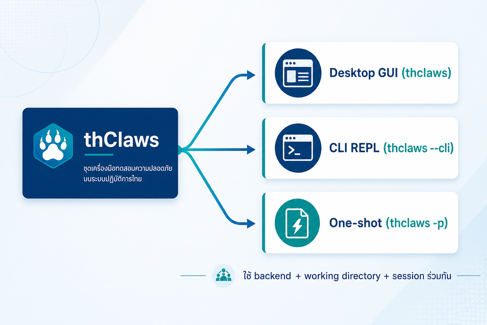
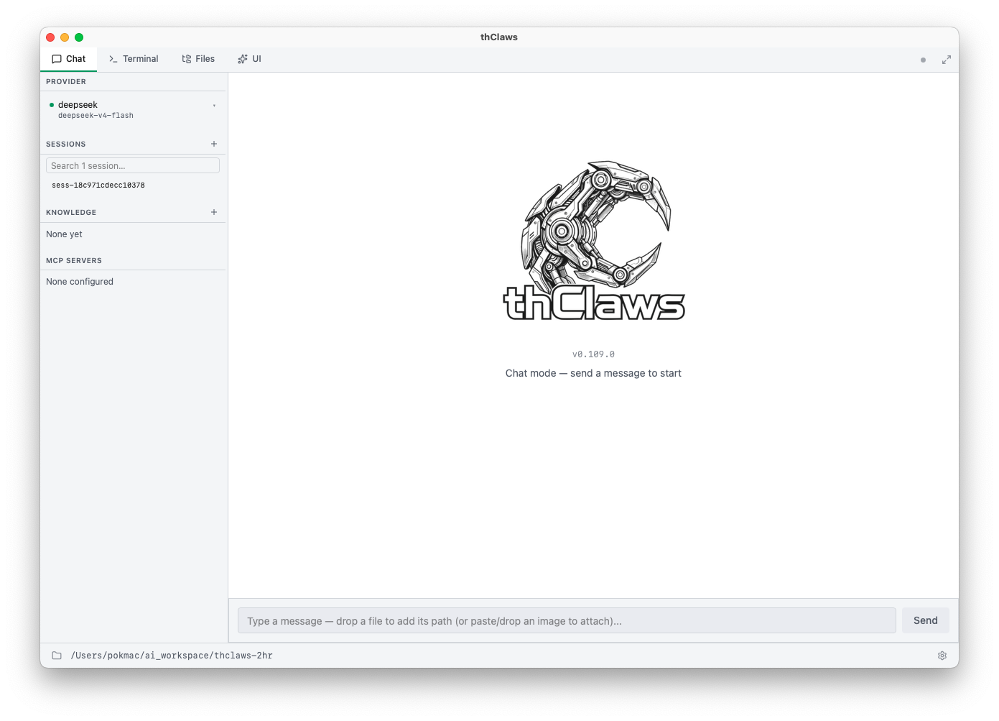
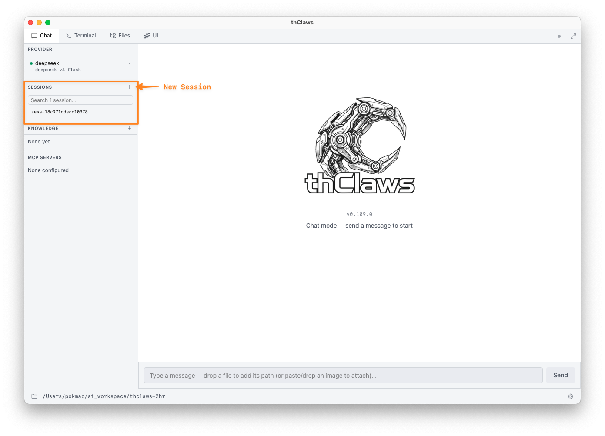
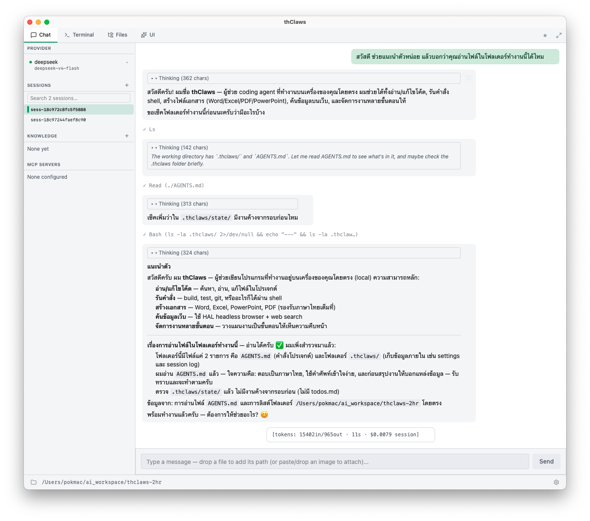
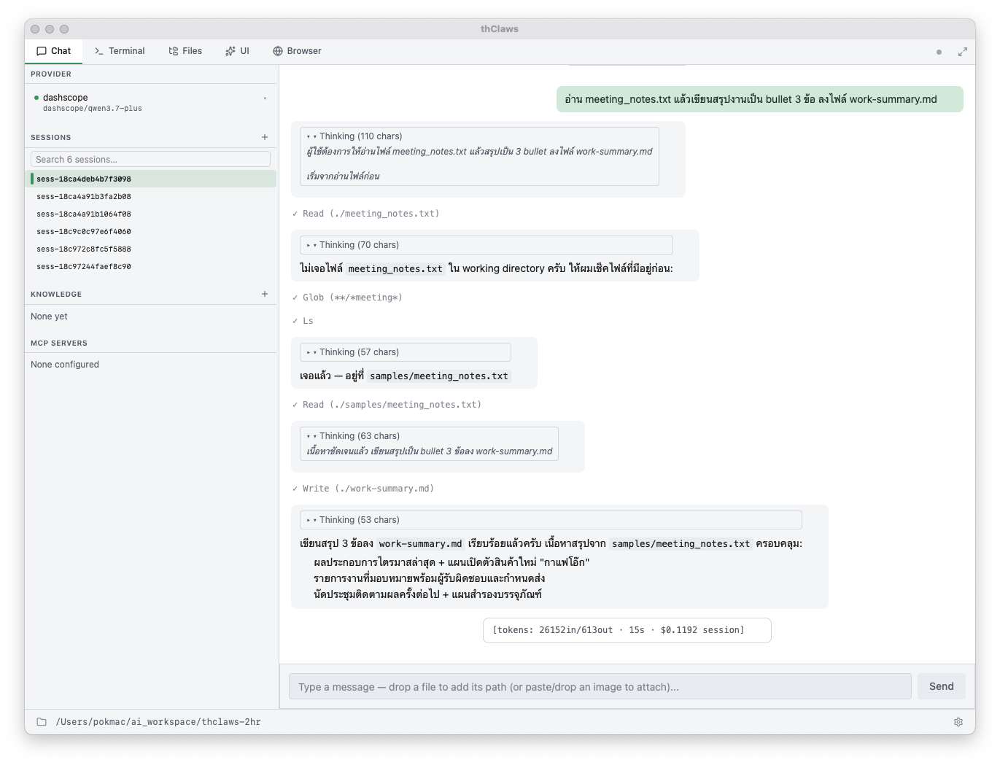

# บทที่ 3 — เริ่มใช้งานจริง: โหมดการทำงาน, session และคำสั่งแรก

> ⏱ อ่าน \~20 นาที + ลงมือ \~20 นาที\
> 🎯 เป้าหมายบทนี้: นำทาง Desktop GUI ได้, เข้าใจ working directory + 3 โหมด + session, และ **ส่งคำสั่งแรกสำเร็จ** — นี่เป็นบทที่สำคัญของทั้งเล่ม

---

## สิ่งที่คุณจะได้จากบทนี้

- ใช้ thClaws ได้ 3 รูปแบบจากโปรแกรมเดียว (GUI / CLI / One-shot)
- เข้าใจว่า working directory คือ "ห้องทำงาน" ของ Agent
- นำทาง Desktop GUI เป็น (Chat / Settings / Sessions / Files)
- เข้าใจว่า session คืออะไร และใช้ให้ถูก
- ส่งคำสั่งแรกได้จริง และสร้างไฟล์แรกได้จริง
- รู้วิธีตอบสนองเมื่อ Agent ขอ permission

---

## 1. thClaws ใช้ได้ 3 รูปแบบ (จากโปรแกรมเดียว)

| รูปแบบ | คำสั่งเปิด | เหมาะกับ |
| --- | --- | --- |
| **Desktop GUI** | `thclaws` | คนทำงานออฟฟิศ — เห็นหน้าตา, ปุ่ม, ตั้งค่า |
| **CLI REPL** | `thclaws --cli` | ต้องการพิมพ์ไว / ใช้เทอร์มินัล |
| **One-shot** | `thclaws -p "คำสั่ง"` | สั่งครั้งเดียวจบ (เช่น ใน script) |

*รูปที่ 3-1 — ทั้ง 3 โหมด (Desktop GUI / CLI / One-shot) มาจากโปรแกรมเดียว ใช้ backend + working directory + session ร่วมกัน*

> 🔑 ทั้ง 3 รูปแบบใช้ **backend เดียวกัน, โฟลเดอร์ทำงานเดียวกัน, session เดียวกัน** — สลับไปมาหากันได้ และเห็นผลงานชุดเดียวกัน

---

## 2. Working directory คือ "ห้องทำงาน" ของ Agent

- โฟลเดอร์ที่คุณเปิด thClaws = **working directory** → Agent อ่าน/เขียนไฟล์ได้เฉพาะในนี้ (sandbox)
- ไฟล์งานทั้งหมด เช่น เอกสาร PDF / XLSX / บันทึก — ให้วางไว้ในนี้
- ตัวอย่าง: `cd ~/thclaws-2hr && thclaws`

> 🔑 จำไว้ว่า: **"cd ไปที่ไหน = เปิด 'ผู้ช่วย' ที่ทำงานในโฟลเดอร์นั้น"** — นี่คือหลัก folder = agent ที่ได้เห็นในบทที่ 1 และจะใช้ต่อในบทที่ 5

---

## 3. เดินชม Desktop GUI (ทำตามจุดนี้ไปทีละจุด)

เปิด thClaws แล้วชี้เทียบกับจุดเหล่านี้:

- **Chat tab** — หน้าหลักสำหรับพิมพ์คุย/สั่งงาน
- **Settings (⚙)** — provider, API key, instruction, ฟีเจอร์เสริม (ที่ตั้งในบทที่ 2)
- **Sessions** — รายการงานที่ทำไปแล้ว (ดู หัวข้อที่ 4)
- **Terminal / Files** — ดู session แบบ CLI / ดูไฟล์ใน working directory
- **Permission prompt** — กล่องขออนุญาตเมื่อ Agent จะทำงาน (ดู หัวข้อที่ 6)



> 📷 **รูปที่ 3-2 — ทัวร์ Desktop GUI (มีตัวเลขชี้จุด)** *(screenshot: ภาพหน้าจอรวมของ thClaws พร้อม callout ตัวเลขชี้ Chat / Settings / Sessions / Files / Permission — แทรกทีหลัง)*

> 💡 เปิด GUI ไปพร้อมกัน แล้วไล่ตามจุดทีละจุด — ไม่ต้องจำทุกปุ่ม แต่ให้รู้ว่าอะไรอยู่ตรงไหน

---

## 4. Session คืออะไร (หัวใจของบทนี้)

**Session = งานหนึ่งชิ้น / บทสนทนาชุดหนึ่ง** — ใช้แยกงานคนละเรื่องออกจากกัน

### ทำไมต้องรู้

| ประเด็น | คำอธิบาย |
| --- | --- |
| แยกงาน | งาน "สรุปประชุม" ≠ งาน "ทำสไลด์" — ควรอยู่คนละ session |
| ประวัติอยู่ | กลับมาดู/ต่อได้ทุกเมื่อ (เก็บใน `./.thclaws/sessions/`) |
| บริบทชัด | session ที่ยาวเกิน → สับสน ควรเริ่มใหม่เมื่อเปลี่ยนเรื่อง |
| ใช้ซ้ำ | session เดิม + folder เดิม = "ผู้ช่วยคนเดิมที่จำงานเดิม" |

### วิธีใช้

- **GUI:** กดปุ่ม **New session** เพื่อเริ่มงานใหม่
- **CLI:** `> /new` เพื่อเริ่ม session ใหม่
- **ดูรายการ:** GUI ใช้ Sessions panel / CLI ใช้ `> /sessions`



> 📷 **รูปที่ 3-3 — หน้าจอ Sessions และปุ่ม New session** *(screenshot: รายการ session + ตำแหน่งปุ่ม New session — แทรกทีหลัง)*

> 🔑 **สูตร:** *หนึ่งงาน = หนึ่ง session* — เปลี่ยนเรื่อง เริ่ม session ใหม่

---

## 5. คำสั่งแรก (ลองจริง)

### 5.1 ส่งคำสั่งแรกผ่าน GUI

เปิด thClaws → ไปที่ **Chat tab** → พิมพ์:

```text
สวัสดี ช่วยแนะนำตัวหน่อย แล้วบอกว่าคุณอ่านไฟล์ในโฟลเดอร์ทำงานนี้ได้ไหม
```



> 📷 **รูปที่ 3-4 — ตัวอย่างคำสั่งแรกใน Chat tab และคำตอบ** *(screenshot: พิมพ์คำสั่งแล้วเห็นคำตอบจาก Agent — แทรกทีหลัง)*

สังเกต: Agent ใช้ instruction ที่คุณตั้งในบทที่ 2 + สำรวจ working directory ก่อนตอบ

### 5.2 ส่งคำสั่งแรกผ่าน One-shot

คัดลอกไฟล์ตัวอย่าง `samples/meeting_notes.txt` ลงใน working directory ก่อน (ไฟล์ตัวอย่างอยู่ที่ `../samples/` — ดู book/README) แล้วรัน:

```bash
thclaws -p "อ่าน meeting_notes.txt แล้วสรุปเป็น bullet 3 ข้อ" -v
```

- `-p "…"` = one-shot — ส่งคำสั่งครั้งเดียวจบ ไม่มีบทสนทนาต่อเนื่อง
- `-v` = verbose — แสดงขั้นตอนการทำงานให้เห็น
- ผลลัพธ์: Agent อ่านไฟล์ `meeting_notes.txt` แล้วสรุปเป็น bullet 3 ข้อ

> 💡 ตัวอย่างผลลัพธ์ที่ควรได้: "1) ยอดขายไตรมาสเพิ่มขึ้น 15% เกินเป้า 2) สินค้าใหม่ 'กาแฟโอ๊ก' เปิดตัว 1 ต.ค. 3) มี action items 4 รายการที่ต้องส่งภายในสิ้นเดือน"

### 5.3 สแลชคำสั่งที่ควรรู้ (คำสั่งแรกที่ใช้บ่อย)

เปิด CLI REPL (`thclaws --cli`) แล้วลองตามลำดับนี้ (ใช้ไฟล์ `meeting_notes.txt` ที่คัดลอกไว้):

```
> /help                    # ดูคำสั่งทั้งหมด
> /new                     # เริ่ม session ใหม่
> /provider dashscope      # สลับ provider เป็น DashScope
> /model qwen-plus         # สลับโมเดลเป็น qwen-plus
> อ่าน meeting_notes.txt แล้วสรุปเป็น bullet 3 ข้อ   # สั่งงานจริง
```

| คำสั่ง | ทำอะไร |
| --- | --- |
| `/new` | เริ่ม session ใหม่ |
| `/model <ชื่อ>` | สลับโมเดล (เช่น `/model qwen-plus`) |
| `/provider <ชื่อ>` | สลับ provider (เช่น `/provider dashscope`) |
| `/help` | ดูคำสั่งทั้งหมด |

### 5.4 ตัวอย่างคำสั่งงานจริง

```
อ่าน meeting_notes.txt แล้วเขียนสรุปงานเป็น bullet 3 ข้อ ลงไฟล์ work-summary.md
```

> 💡 คราวนี้ Agent ใช้หลาย tool: `Read` (อ่านไฟล์) → `Write` (สร้างไฟล์ใหม่) — สังเกต `[tool: …]` ในคำตอบ และเห็นไฟล์ `work-summary.md` ปรากฏใน working directory



> 📷 **รูปที่ 3-5 — ไฟล์ work-summary.md ปรากฏใน working directory** *(screenshot: หน้าจอ Files panel หรือ Finder เห็นไฟล์ work-summary.md ที่สร้างจริง)*

---

## 6. Permission — ควบคุมการขออนุญาตด้วยคำสั่ง /permission

thClaws **ขออนุญาตก่อน** ทำงานที่ไวต่อผล เช่น สร้างไฟล์, รันคำสั่ง, เข้าเน็ต — แต่คุณควบคุมได้ว่าจะให้ขอเมื่อไหร่ ด้วยคำสั่ง:

```text
/permission <โหมด>
```

มี 4 โหมดให้เลือก:

| โหมด | ความหมาย |
| --- | --- |
| `auto` | **ไม่ถามเลย** — ทำงานได้ทันทีทุกอย่าง (never prompt) |
| `ask` | **ถามทุกครั้ง** เฉพาะ tool ที่แก้ไข/มีผล (mutating tools) เช่น สร้างไฟล์, รันคำสั่ง |
| `plan` | **สำรวจแบบ read-only** — อ่าน/สืบค้นได้ แต่ tool ที่แก้ไขถูกบล็อก (mutating tools blocked) |
| `linegated` | ส่งคำขออนุมัติไปที่ **LINE chat** — เปิดใช้งานอัตโนมัติเมื่อจับคู่ LINE แล้ว (ดูบทที่ 21) |

> 📷 **รูปที่ 3-6 — ตัวอย่าง permission prompt เมื่อ Agent ขอทำงาน** *(screenshot: กรอบขออนุญาต (สร้างไฟล์/รันคำสั่ง) พร้อมปุ่ม อนุญาต/ปฏิเสธ)*

> 🔑 permission คือเกราะสำคัญของความเป็น local-first — **ตรวจก่อนกดอนุญาตเสมอ** ให้สิทธิ์ "น้อยที่สุดที่จำเป็น": ทำงานประจำใช้ `ask` (หรือ `linegated`), ใช้ `auto` เฉพาะงานที่ไว้ใจได้เต็มที่, ใช้ `plan` เมื่ออยากให้ Agent ไปสำรวจก่อนโดยไม่แตะต้องอะไร

---

## ลงมือทำเอง (บทที่สำคัญของเล่ม — ขอให้ทำสำเร็จ)

ทำตามลำดับ แล้วติ๊กเมื่อผ่าน:

- [ ] เปิด `thclaws` (GUI) จากโฟลเดอร์ `~/thclaws-2hr`

- [ ] เดินชม GUI ครบจุด (Chat / Settings / Sessions / Files) (§3)

- [ ] ส่งคำสั่งแรกผ่าน GUI แล้วได้คำตอบ (ใช้ภาษาไทย) ✅

- [ ] เปิด session ใหม่ด้วยปุ่ม **New session**

- [ ] ลอง `thclaws --cli` + `thclaws -p "..."` อย่างละ 1 ครั้ง (สลับ 3 โหมด)

- [ ] ลอง `/model qwen-plus` แล้วถามต่อ

- [ ] สร้างไฟล์จริงด้วยคำสั่ง (เช่น `work-summary.md`) และเห็นไฟล์ใน working directory ✅

> 💡 สังเกตตอนสั่งสร้างไฟล์ — Agent จะขอ permission คุณกดอนุญาตให้ ตรวจดูสิ่งที่มันจะทำก่อนเสมอ

---

## ตรวจความเข้าใจ (เช็กก่อนขึ้นบทถัดไป)

**1.** thClaws ใช้งานได้กี่รูปแบบ?

- ก. เฉพาะ GUI
- ข. 2 รูปแบบ (GUI + web)
- ค. 3 รูปแบบ (Desktop GUI / CLI / One-shot)
- ง. 5 รูปแบบ

**2.** Session คืออะไร?

- ก. หนึ่งงาน/บทสนทนาชุดหนึ่ง แยกเรื่องกันได้
- ข. ใบเสร็จค่าใช้จ่าย
- ค. ชนิดของโมเดล
- ง. โฟลเดอร์ระบบ

**3.** เมื่อ Agent ขอ "ทำงาน" (สร้างไฟล์/รันคำสั่ง) คุณควร?

- ก. กด Allow all ทันที
- ข. ตรวจ permission prompt ก่อน แล้วอนุญาตเฉพาะที่เข้าใจ
- ค. ไม่ยอมอนุญาตเลย
- ง. ปิดโปรแกรม

---

เฉลย

- **ข้อ 1:** ค — 3 รูปแบบ (Desktop GUI / CLI / One-shot) จากโปรแกรมเดียวกัน
- **ข้อ 2:** ก — หนึ่งงาน = หนึ่ง session เพื่อแยกเรื่อง
- **ข้อ 3:** ข — ตรวจ permission ก่อน แล้วอนุญาตเฉพาะที่เข้าใจ (ห้าม Allow all มั่ว)

ผ่านทุกข้อ → ขึ้นบท 4 ได้เลย

---

## ปัญหาที่พบบ่อย / คำถามที่คนเริ่มต้นมักถาม

| คำถาม | คำตอบ |
| --- | --- |
| "GUI กับ CLI ต่างกันยังไง ใช้อันไหน" | เหมือนกัน (backend เดียว) — GUI เห็นภาพ/ตั้งค่าง่าย, CLI พิมพ์ไว; ใช้ตามที่ถนัด |
| "เผลอปิด session จะหายไหม" | ไม่หาย — ประวัติเก็บใน `./.thclaws/sessions/` กลับมาเปิดต่อได้ |
| "session ยาวเกิน สับสนทำไง" | เริ่ม session ใหม่เมื่อเปลี่ยนเรื่อง (ปุ่ม New session / `/new`) |
| "Agent ขอสิทธิ์เยอะไป" | ตรวจ prompt ทีละอัน อนุญาตเฉพาะที่เข้าใจ; ให้สิทธิ์น้อยที่สุด |
| "คำสั่งแรกไม่ตอบ" | เช็ก Key/เน็ต (บท 2) + เช็กว่า `cd` เข้าโฟลเดอร์ถูก |

**ข้อผิดพลาดที่คนเริ่มต้นมักทำ:**

- ❌ เปลี่ยนเรื่องโดยไม่เริ่ม session ใหม่
- ❌ กด "Allow all" โดยไม่ตรวจ content
- ❌ ลืมว่า One-shot (`-p`) = ไม่มีบทสนทนาต่อเนื่อง (ส่งทีเดียวจบ)

---

## สรุปบท

| หัวข้อ | สาระ |
| --- | --- |
| 3 โหมด | GUI / CLI / One-shot — มาจากตัวเดียวกัน |
| Working directory | ห้องทำงานของ Agent (sandbox) |
| Session | หนึ่งงาน = หนึ่ง session |
| คำสั่งแรก | สั่งผ่าน GUI/CLI ได้เลย; รู้ `/new` `/model` `/help` |
| Permission | ตรวจก่อนอนุญาตเสมอ |

> **ประโยคส่งต่อ:** พิมพ์ได้แล้ว ต่อไปคือ "ของที่ทำให้มันทำงานได้จริง" — บทที่ 4 จะแนะนำ Tools, Skills และ MCP