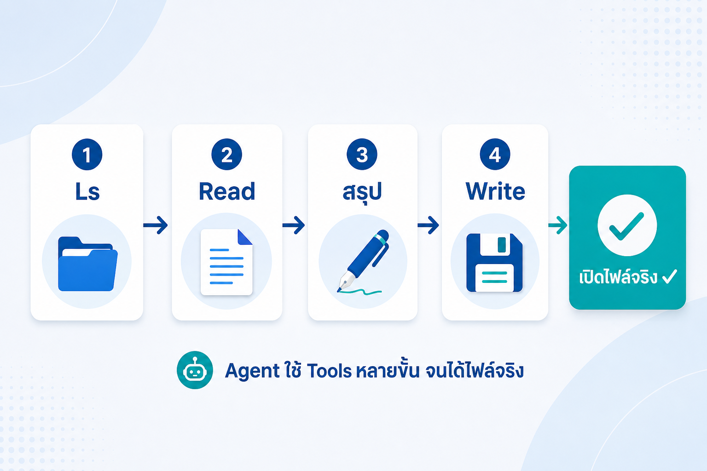
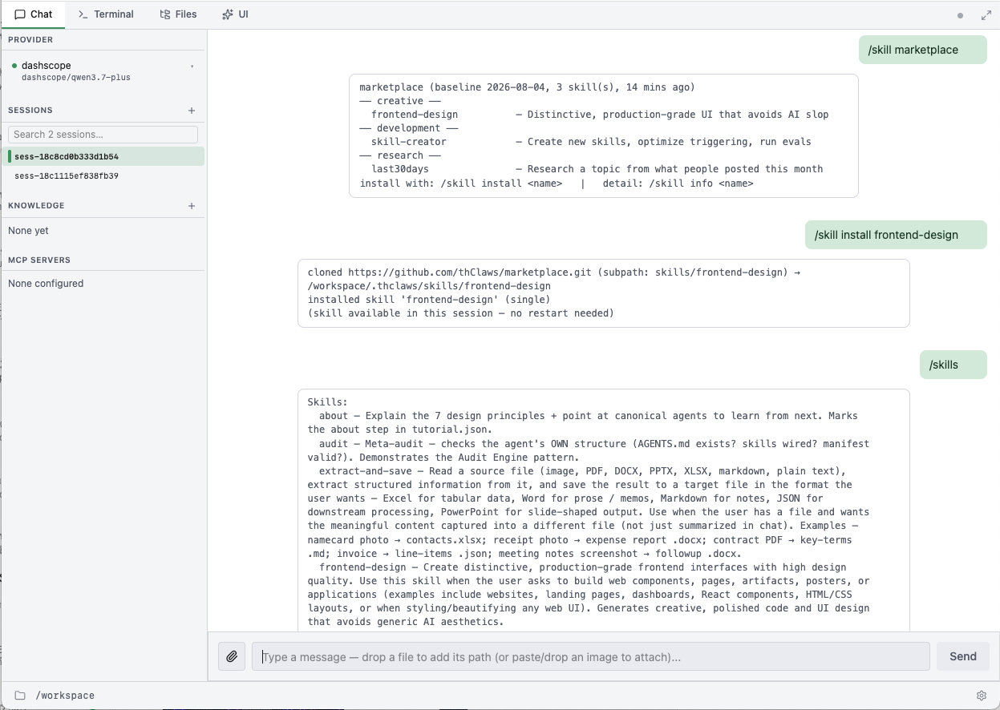
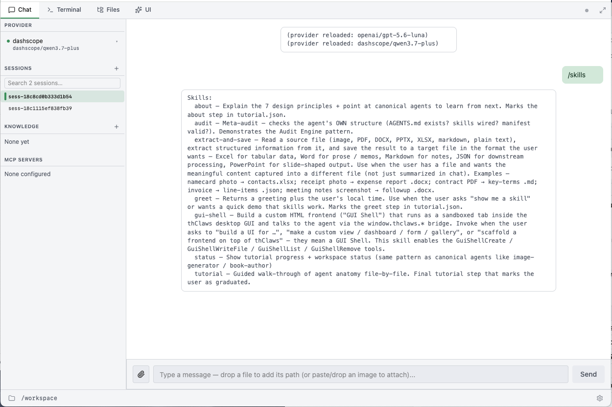
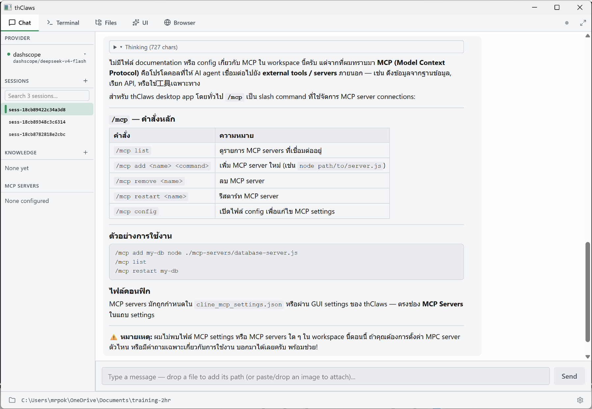

# บทที่ 4 — Tools, Skills, MCP: ของที่ทำให้ "ทำงาน" ได้จริง

> ⏱ อ่าน ~25 นาที + ลงมือ ~15–20 นาที
> 🎯 เป้าหมายบทนี้: เห็น "มือ" ของ Agent (built-in tools), รู้จัก/ติดตั้ง/เรียกใช้ Skill, และเข้าใจ MCP ว่าเชื่อมต่อกับบริการภายนอกอย่างไร

---

## สิ่งที่คุณจะได้จากบทนี้

- เข้าใจว่า Built-in tools คือ "มือ" ของ Agent ที่ทำให้มันทำงานจริง (ไม่ใช่แค่ตอบ)
- รู้จัก Tools กลุ่มไฟล์และกลุ่มอื่นๆ
- ลอง use case งานออฟฟิศจริงอย่างน้อย 1 อย่าง
- รู้ว่า Skill คืออะไร ต่างจาก Tool อย่างไร ติดตั้งและเรียกใช้ได้
- เข้าใจแนวคิด MCP และวิธีตั้งค่า/เรียกใช้เบื้องต้น

---

## 1. Built-in Tools คือ "มือ" ของ Agent

thClaws มี **built-in tools 38+ tools** ครอบคลุมการทำงานตั้งแต่เขียนโค้ด, สร้างเอกสาร, ท่องเว็บ, สร้างสื่อ AI, จัดการความรู้, ไปจนถึง automation แบบเต็มรูปแบบ** ที่ Agent เลือกใช้เองอัตโนมัติ — สังเกตเห็นได้จากเครื่องหมาย `[tool: Name: …]` ตามด้วย ✓ (สำเร็จ) หรือ ✗ (error) ในคำตอบ

![รูปที่ 4-1 — ตัวอย่างเครื่องหมาย `[tool: …]` ในคำตอบ"](screenshots/ss-4-1.png)

> 📷 **รูปที่ 4-1 — ตัวอย่างเครื่องหมาย `[tool: …]` ในคำตอบ** *(screenshot: หน้าจอคำตอบที่แสดง `[tool: Read: …] ✓` / `[tool: Write: …] ✓` — จุดที่ "เห็นว่า Agent ทำงาน")*

> 🔑 นี่คือหัวใจที่ทำให้ **ต่างจาก Chat AI** — Chat "ตอบ" แต่ Agent "ลงมือ" ผ่าน tools เหล่านี้ จนได้ผลลัพธ์จริง

### 1.1 Tools กลุ่มไฟล์ (ทำงานใน working directory)

| Tool | อนุมัติ | ใช้ทำอะไร |
|------|--------|-----------|
| `Ls` | auto | ดูรายการไฟล์ในโฟลเดอร์ |
| `Read` | auto | อ่านไฟล์ (ทั้งไฟล์หรือช่วงบรรทัด) |
| `Glob` | auto | หาไฟล์จากชื่อ/pattern |
| `Grep` | auto | ค้นข้อความข้ามไฟล์ |
| `Write` | prompt | สร้าง/เขียนทับไฟล์ |
| `Edit` | prompt | แก้ไขข้อความในไฟล์แบบตรงจุด |

> ทั้งหมดถูกจำกัดอยู่ใน **sandbox** (= working directory) — Agent เขียนไฟล์เกินขอบเขตไม่ได้โดยไม่ได้รับอนุญาต

### 1.2 Tools กลุ่มอื่นๆ

| Tool | ใช้ทำอะไร |
|------|-----------|
| `Bash` | รันคำสั่ง shell (pattern อันตรายจะถูกเตือนก่อนขออนุมัติ) |
| `WebFetch` | อ่านเนื้อหาเว็บ / หน้าเว็บ |
| `WebSearch` | ค้นหาในเว็บ |
| `WebScrape` | ดึงเนื้อหาเว็บแบบลึก (ต้องตั้งค่า HAL) |
| `YouTubeTranscript` | ดึง transcript ของคลิป YouTube |
| + เอกสาร/สเปรดชีต/สไลด์/PDF | สร้าง-อ่านไฟล์ DOCX / XLSX / PPTX / PDF |

---

## 2. ตัวอย่างการใช้งาน Built-in Tools (งานออฟฟิศจริง)

### 2.1 ตัวอย่างโจทย์ที่เห็น "เครื่องมือ" ทำงาน

ลองโจทย์นี้ (ใช้ไฟล์ตัวอย่างในโฟลเดอร์ `samples/`): ดาวน์โหลดจาก link ที่หน้าหลัก

> "อ่านไฟล์ `meeting_notes.txt` ในนี้ แล้วสรุปเป็น bullet 3 ข้อ แล้วเขียนลงไฟล์ `summary.md`"

สิ่งที่ควรสังเกต:
- Agent ใช้ `Ls` / `Read` เพื่อหาและอ่านไฟล์
- จากนั้นใช้ `Write` เพื่อสร้างไฟล์ใหม่ → มี permission prompt — คุณตรวจแล้วกดอนุญาต
- เปิด `summary.md` ใน working directory → **เห็นไฟล์จริง** ✅



*รูปที่ 4-2 — ขั้นตอนการสั่ง "อ่าน → สรุป → เขียนไฟล์": Ls → Read → (สรุป) → Write → เปิดไฟล์จริง*

### 2.2 งานออฟฟิศที่ Tools ทำได้ (เทียบกับ Chat AI)

| งาน | Tools ที่ใช้ | Chat AI ทำได้ไหม |
|-----|-------------|------------------|
| สรุป PDF 50 หน้าเป็น bullet | Read (+PdfRead) | ❌ ต้อง copy-วางเอง |
| สร้าง Excel ยอดขายจากข้อมูล | Write/Xlsx | ⚠️ ให้สูตรอย่างเดียว |
| รวมไฟล์ 10 อันเป็นเอกสารเดียว | Read + Write | ❌ |
| ค้นข้อมูลล่าสุด + สรุป | WebSearch/WebFetch | ✅ แต่ไม่รับประกันถูก |
| สร้างสไลด์จากหัวข้อ | Pptx | ⚠️ ทำได้ครึ่งๆ |

---

## 3. Skills — "วิธีทำงานแบบสำเร็จรูป"


### 3.1 Skill คืออะไร

Skill คือ ชุดกระบวนการทำงานสำเร็จรูป (Packaged Workflow) ที่รวมเอา เงื่อนไขการเรียกใช้ (Trigger), ขั้นตอนการตัดสินใจ (Logic Step) และ การใช้เครื่องมือ (Tools Executions) เข้าไว้ด้วยกันอย่างเป็นหมวดหมู่ ช่วยให้ AI Agent สามารถนำไปใช้ซ้ำ (Reusable) ได้ทันทีตามชื่อ หรือคำอธิบายบทบาทของ Skill นั้นๆ

> 🔑 ต่างจาก Tool (เครื่องมือ) ตรงที่ **Skill คือวิธีทำงานทั้งชุด (SOP)** — เช่น "skill สรุปประชุม" = วิธีสรุป + เงื่อนไข + ขั้นตอนย่อย

### 3.2 ดู / ติดตั้ง / เรียกใช้

**ดู skills ที่ติดตั้งในเครื่อง:**
- `> /skills` (CLI) หรือ panel **Skills** (GUI) — ดูว่ามี skill อะไรติดตั้งอยู่แล้วบ้าง

**ดู & ติดตั้ง skill จาก marketplace:**
- `> /skill marketplace` — ดูรายการ skill ที่มีให้ติดตั้งใช้งาน
- `> /skill install <name>` — ติดตั้ง skill จาก marketplace ตามชื่อ

**ทดลองติดตั้งจริง (skill ชื่อ `frontend-design`):**
```
> /skills                          # ดู skills ที่ติดตั้งในเครื่อง
> /skill marketplace               # ดู skill ที่มีใน marketplace
> /skill install frontend-design   # ติดตั้ง skill "frontend-design"
```

รูปที่ 4-3 — รายการ skill ที่มีอยู่ใน workspace และการติดตั้งจาก marketplace

**การติดตั้ง skills จาก git repo**

สำหรับ skill ที่ไม่ได้อยู่ใน marketplace ใส่ git URL ใด ๆ ก็ได้:


> /skill install https://github.com/some-user/some-skill.git
> 
>   cloned https://github.com/some-user/some-skill.git → .thclaws/skills/some-skill
>  installed skill 'some-skill' (single)

ค้นหา skills ที่อยู่ใน github ที่ต้องการ ตัวอย่างเช่น https://github.com/anthropics/skills

> ถ้า repo เป็น bundle (มี skill หลายตัวใน subdirectory) thClaws จะตรวจจับและเลื่อน sub-skill แต่ละตัวขึ้นมาเป็น sibling ที่ .thclaws/skills/sub-name/

**หากต้องการเลือกติดตั้งแค่เพียงตัวใดตัวหนึ่งจาก repo**

ต้องใช้ Subpath syntax (ดึง skill เดียวออกจาก repo ที่มีหลาย skill)
ใช้ extension #<branch>:<subpath> เพื่อติดตั้งเฉพาะ directory หนึ่งใน repo:

ตัวอย่างเช่น ต้องการแค่ frontend-design จาก repo ของ anthropics

```
❯ /skill install https://github.com/anthropics/skills.git#main:skills/frontend-design
```



> 📷 **รูปที่ 4-3 — หน้าจอ Skills panel / ผลลัพธ์ `/skills`** *(screenshot: รายการ skill ที่มีใน workspace)*

**การเรียกใช้ หลังจากติดตั้ง skills :**
- **อัตโนมัติ:** พิมพ์คำขอที่ตรงกับ trigger ของ skill → Agent ใช้เอง
- **บังคับ (ระบุ):** ใช้ข้อความที่ตรงเงื่อนไข หรือระบุชื่อ skill ในคำสั่ง

**ตัวอย่าง:**
```
> ใช้ frontend-design ช่วยออกแบบ html page จากข้อมูลในไฟล์ 
monthly-sales.csv ในรูปแบบ dashboard
```

---

## 4. MCP — "สะพานเชื่อมต่อข้อมูลบริการภายนอก"

### 4.1 MCP คืออะไร

**Model Context Protocol (MCP) = มาตรฐานสำหรับให้ Agent ใช้เครื่องมือภายนอก** เป็นมาตรฐานเปิด (Open Standard) ที่ถูกคิดค้นโดย Anthropic ซึ่งทำหน้าที่เป็น "สะพานเชื่อม" หรือโปรโตคอลมาตรฐานที่เปิดโอกาสให้ Session ใน AI Agent สามารถเชื่อมต่อกับแหล่งข้อมูลภายนอก (เช่น File Systems, GitHub, Databases) Google Drive, GitHub, ฐานข้อมูล, เซอร์วิสของบริษัท ในลักษณะ Stateful Connection โดย Session จะทำหน้าที่เป็นช่องทางส่งสัญญาณควบคุม ขณะที่ข้อมูลจริงจะถูกสตรีมเข้ามาใน Context เท่าที่จำเป็นเท่านั้น

> 🔑 เปรียบ: *Tool = เครื่องมือของ Agent / MCP = ปลั๊กไฟมาตรฐานสากลเพื่อดึงข้อมูลและเครื่องมือภายนอกมาให้ใช้*

### 4.2 การเชื่อมต่อ & การเรียกใช้

1. **ตั้งค่าด้วย /MCP** — เพิ่ม server (ระบุ URL/command + key)
2. **ตั้งค่าด้วย การสร้าง JSON ไฟล์ เก็บใน ./thclaws**
3. **เรียกใช้** — พิมพ์คำขอที่ต้องใช้บริการนั้น → Agent ใช้ tool จาก MCP นั้น
   - ตัวอย่าง: ต่อ MCP กับ Google Drive → "ช่วยดึงไฟล์จาก Drive แล้วสรุป"

**หากต้องการความช่วยเหลือในการต้ังค่าหรือใช้งาน MCP บน thClaws สามารถพิมพ์**

```
❯ แสดงการใช้คำสั่ง /mcp และการใช้งาน
```

> เนื่องจากการเชื่อมต่อ MCP จะต้องมีการ setup จากฝั่งผู้ให้บริการ ดังนั้นในจะมีขั้นตอนของแต่ละผู้ให้บริการไม่เหมือนกัน ต้องศึกษาจากหน้าเว็ปของแต่ละค่าย


> 📷 **รูปที่ 4-4 — แสดงคำสั่ง /MCP ** *(screenshot: รูปที่ 4-4 — แสดงคำสั่ง /MCP)*

---

## ลงมือทำเอง (เลือกทำอย่างน้อย 1 ข้อ)

ใช้ไฟล์ตัวอย่างในโฟลเดอร์ `samples/` (คัดลอกลง working directory ก่อน):

- [ ] สร้างไฟล์ `meeting_notes.txt` → สั่ง "อ่าน + สรุปเป็น bullet + เขียนลง `summary.md`" → เปิดดูไฟล์ ✅
- [ ] สั่งให้สร้าง Excel/สเปรดชีตจากข้อมูลง่ายๆ (เช่น `monthly-sales.csv` → `sales-report.xlsx`) → เห็นไฟล์ .xlsx ✅
- [ ] ถามคำถามที่ต้องค้นเว็บ (เช่น "ราคา … ล่าสุด") → สังเกต Agent ใช้ WebSearch
- [ ] (ระดับสูง) `/skill marketplace` + `/skill install frontend-design` แล้วลองเรียกใช้ skill ที่ติดตั้ง
- [ ] (ระดับสูง) เชื่อม MCP 1 ตัว + เรียกใช้จริง

**สังเกตหลังทำ:** เจอ `[tool: …]` ในคำตอบไหม? — ถ้าเห็น แปลว่า Agent "ลงมือ" จริง ไม่ใช่แค่ตอบ

---

## ตรวจความเข้าใจ (เช็กก่อนขึ้นบทถัดไป)

**1.** "Skill" ใน thClaws คืออะไร?
- ก. วิธีทำงานแบบสำเร็จรูป (workflow + trigger) เรียกใช้ซ้ำได้
- ข. เกมฝึกทักษะ
- ค. ชนิดของแป้นพิมพ์
- ง. สีของเทอร์มินัล

**2.** MCP ใช้ทำอะไร?
- ก. เชื่อมต่อบริการภายนอก (Drive, GitHub, DB) ให้ Agent ใช้
- ข. เพิ่มความเร็วเน็ต
- ค. บีบอัดไฟล์
- ง. แปลภาษา

**3.** จะรู้ได้อย่างไรว่า Agent "ลงมือ" ใช้ tools จริง?
- ก. เห็นไฟล์สร้างขึ้นจริง + สังเกต `[tool: …]` ในคำตอบ
- ข. ไม่สามารถรู้ได้
- ค. ต้องเปิดกล้อง
- ง. เดาจากเสียง

---

<details><summary>เฉลย</summary>

- **ข้อ 1:** ก — Skill = workflow + trigger ใช้เรียกซ้ำได้
- **ข้อ 2:** ก — MCP = สายเชื่อมต่อบริการภายนอกให้ Agent ใช้
- **ข้อ 3:** ก — เห็นไฟล์จริง + `[tool: …]` ในคำตอบ

ผ่านทุกข้อ → ขึ้นบท 5 ได้เลย

</details>

---

## ปัญหาที่พบบ่อย / คำถามที่คนเริ่มต้นมักถาม

| คำถาม | คำตอบ |
|--------|-------|
| "Tool กับ Skill ต่างกันยังไง" | Tool = มือ (ทำทีละอย่าง) / Skill = วิธีทำทั้งชุด (workflow + trigger) |
| "ทำไม Agent เขียนไฟล์เกินโฟลเดอร์ไม่ได้" | เพราะ sandbox จำกัดอยู่ที่ working directory — ปลอดภัย; อยากให้แก้ที่อื่น ให้ย้ายไฟล์เข้ามา |
| "Skill หา/ติดตั้งยังไง" | `/skills` ดูที่มีในเครื่อง; `/skill marketplace` ดูที่มีให้ติดตั้ง; `/skill install <name>` ติดตั้งจาก marketplace |
| "MCP ต้องมีอะไรก่อน" | ต้องมี server/key ของบริการนั้น + ตั้งใน Settings → MCP |
| "ผลลัพธ์ผิด (AI หลอน)" | ตรวจทานเสมอ; prompt ให้ชัด + ขอให้ระบุที่มา |

**ข้อผิดพลาดที่คนเริ่มต้นมักทำ:**
- ❌ เอา Skill กับ Tool สลับกัน
- ❌ ลืมตรวจผลลัพธ์
- ❌ วางไฟล์ไว้นอก working directory แล้วงงว่าทำไมอ่านไม่เจอ

---

## สรุปบท

| หัวข้อ | สาระ |
|--------|------|
| Tools | มือของ Agent (~30 ตัว): ไฟล์ / Shell / Web / เอกสาร |
| ต่างจาก Chat | Agent ลงมือผ่าน tools → สร้างไฟล์จริง |
| Skills | วิธีทำงานแบบสำเร็จรูป (SOP) เรียกใช้ซ้ำได้ |
| MCP | สายเชื่อมต่อบริการภายนอก (Drive / DB / GitHub) |
| ดูได้ | `[tool: …]` ในคำตอบ = เห็นว่า Agent ทำงาน |

> **ประโยคส่งต่อ:** Agent มี "มือ" แล้ว ต่อไปคือการรู้จักบริการคลาวด์ของ thClaws — บทที่ 5 จะแนะนำ thClaws.cloud (คลัง agent + hosted workspace + model gateway)