# บทที่ 5 — thClaws.cloud: บริการคลาวด์สำหรับ thClaws

> ⏱ อ่าน ~15 นาที + ลงมือ ~10 นาที
> 🎯 เป้าหมายบทนี้: รู้จัก thClaws.cloud ว่าคืออะไร (3 องค์ประกอบ), สมัคร/เข้าใจสถานะ beta, เข้าใจระบบเครดิตกับแพ็กเกจ, ตั้งค่า Access Key บน desktop, และใช้งาน Hosted Workspace

---

## สิ่งที่คุณจะได้จากบทนี้

- เข้าใจว่า thClaws.cloud คืออะไร และมี 3 องค์ประกอบหลักอะไรบ้าง
- รู้วิธีสมัครใช้งาน (และสถานะ close-beta ที่ต้องติดต่อ admin)
- เข้าใจระบบเครดิต (Pay-per-use) และแพ็กเกจ Workspace
- สร้าง **Access Key** (`thc_…`) และตั้งค่าใน desktop app ได้
- รู้จัก Hosted Workspace: scale-to-zero, warm-up, การสลับระหว่าง desktop กับ cloud

---

## 1. thClaws.cloud คืออะไร

**thClaws.cloud** เป็นเว็บไซต์ที่ให้บริการ thClaws พร้อม AI Agents ที่ผู้ใช้พัฒนาขึ้นสำหรับงานต่าง ๆ เป็นแหล่งรวบรวมและให้บริการ AI Agents สำหรับผู้ใช้งาน thClaws ทั้ง Desktop และ thClaws.cloud

คุณสามารถ**สลับการทำงาน workspace ระหว่าง desktop และ cloud** ได้อย่างราบรื่น เมื่อต้องการให้ Agent ทำงานแบบต่อเนื่อง พร้อมทั้งยังมีบริการเชื่อมต่อ **AI Models Gateway** กับ thClaws Desktop สำหรับผู้ที่ต้องการใช้งาน AI Models ที่หลากหลาย ช่วยแก้ปัญหาความยุ่งยากและเพิ่มความคุ้มค่าในการใช้งาน AI Model

> 🔑 **folder-is-agent:** หัวใจที่ทำให้สลับ desktop ↔ cloud ได้คือแนวคิด **agent = โฟลเดอร์หนึ่ง** ที่มี `AGENTS.md` (ตัวตน/คำสั่ง), `manifest.json` (metadata) และ `./.thclaws/` (state) — "ตัวเดียวกัน" นี่เองที่แชร์/ซิงก์/รันบนคลาวด์ได้

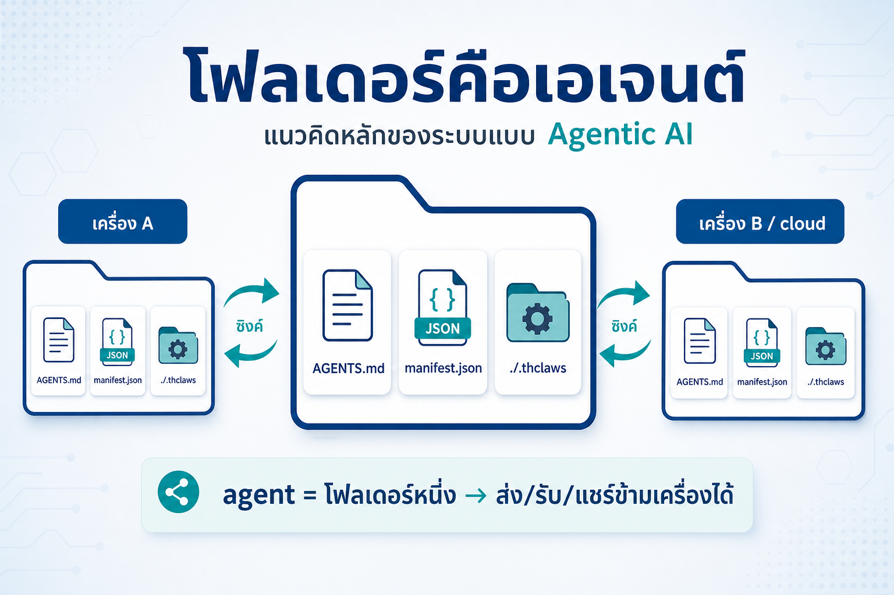

*รูปที่ 5-1 — folder-is-agent: agent = โฟลเดอร์ที่มี AGENTS.md + manifest.json + ./.thclaws — สิ่งนี้เองที่สลับ/แชร์ระหว่าง desktop กับ thClaws.cloud ได้*

---

## 2. การสมัครใช้งาน

ผู้ที่จะใช้งาน thClaws.cloud จะต้องมี **Account** โดยสามารถสร้าง account ได้ 3 วิธี:

1. สมัครใช้งานด้วย **email address**
2. สมัครใช้งานด้วยการเชื่อมกับ **Google Account**
3. สมัครใช้งานด้วยการเชื่อมกับ **Microsoft Copilot**

> ⚠️ **สถานะ close-beta:** ระบบ thClaws.cloud ปัจจุบันยังเป็น **close-beta** — หากต้องการสมัคร ต้องติดต่อกับ admin หรือทำเรื่องขอเข้าใช้งานระบบ เมื่อได้รับอนุมัติแล้วจะมี **email invited** ติดต่อกลับไป

---

## 3. ระบบของ thClaws.cloud

thClaws.cloud เป็นระบบโครงสร้างพื้นฐานบนคลาวด์ (Cloud Infrastructure) ที่ออกแบบมาเพื่อสนับสนุนการทำงานของเดสก์ท็อปแอปพลิเคชันอย่างครบวงจร โดยเชื่อมโยงการทำงาน การจัดการข้อมูล และการประมวลผล AI ไว้ด้วยกันผ่าน **3 องค์ประกอบหลัก**:

### 3.1 AI Agents Library (คลังตัวช่วย AI)

ศูนย์รวมและคลังจัดเก็บ AI Agents ที่พร้อมใช้งานและสามารถปรับแต่งได้ — ค้นหา ดาวน์โหลด หรือแบ่งปัน Agent เพื่อนำมาช่วยทำงานเฉพาะทางได้อย่างสะดวก

- **การดึงใช้งาน (`/cloud get`):** เลือกค้นหาและดาวน์โหลด Agent จากคลังกลางมาใช้งานบนเครื่องเดสก์ท็อปได้ทันที
- **การเผยแพร่ (`/cloud publish`):** อัปโหลด Agent ที่สร้างหรือปรับแต่งเองขึ้นไปแบ่งปันในคลังกลาง เพื่อใช้งานข้ามเครื่องหรือแบ่งปันในองค์กร
- **ลดการตั้งค่าเริ่มต้น:** ไม่ต้องสร้างหรือพรอมต์ Agent ใหม่ตั้งแต่ต้น — เลือกใช้ Agent ที่ปรับแต่งมาเฉพาะสำหรับงานแต่ละประเภทได้ทันที

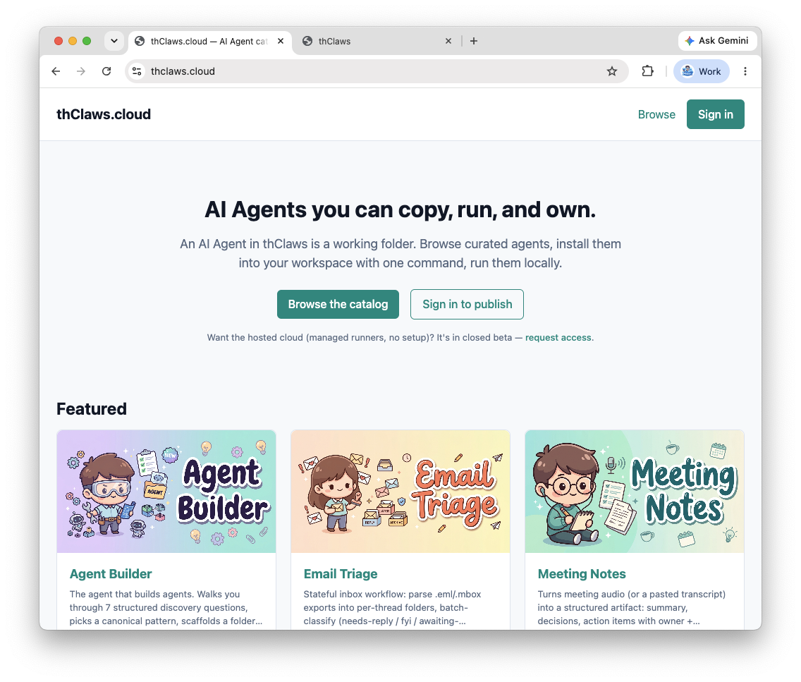<div align="center">รูปที่ 5-2 — Browse AI Agents </div>

### 3.2 Hosted Workspace (พื้นที่ทำงานบนคลาวด์)

บริการพื้นที่จัดเก็บและซิงก์ข้อมูลพื้นที่ทำงาน (Workspace) บนคลาวด์ — จัดการไฟล์ โครงสร้างโปรเจกต์ และสถานะการทำงานให้ต่อเนื่อง เข้าถึงได้จากทุกอุปกรณ์

- **การสำรองและซิงก์ข้อมูล (`/cloud push` & `/cloud pull`):** ส่งข้อมูลงานปัจจุบันขึ้นเก็บบนคลาวด์ หรือดึงข้อมูลงานล่าสุดลงมาทำงานต่อบนเครื่องอื่นได้อย่างรวดเร็ว
- **การทำงานข้ามอุปกรณ์ (Multi-device Continuity):** สภาพแวดล้อมการทำงาน ประวัติ และไฟล์ที่เกี่ยวข้องตรงกันเสมอ ไม่ว่าจะเปลี่ยนไปทำงานบนคอมพิวเตอร์เครื่องใด
- **การกู้คืนข้อมูล:** ทำหน้าที่เป็นระบบสำรองข้อมูลในตัว ลดความเสี่ยงข้อมูลสูญหายเมื่อคอมพิวเตอร์เกิดปัญหา

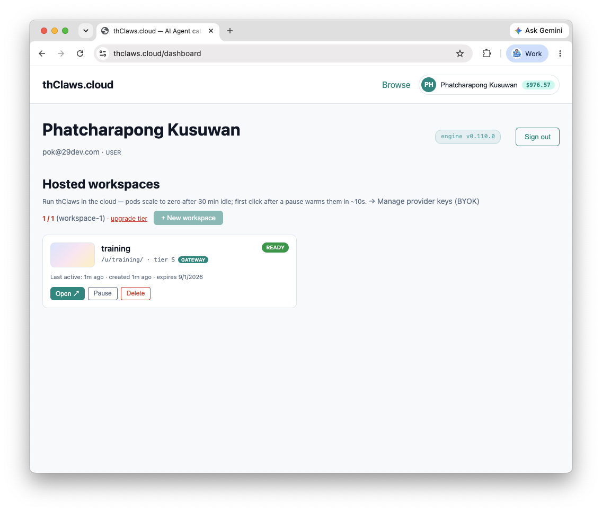<div align="center">รูปที่ 5-3 — hosted workspace </div>

### 3.3 AI Model Gateway (ประตูเชื่อมต่อโมเดล AI)

ตัวกลางบริหารจัดการและกระจายคำสั่งการประมวลผลไปยังโมเดลภาษาขนาดใหญ่ (LLM) หลากหลายค่าย — ลดความซับซ้อนในการจัดการ API Key และการคิดค่าบริการ

- **จุดเชื่อมต่อเดียว (Single Proxy Endpoint):** ประมวลผลคำสั่ง LLM ผ่าน Gateway เดียว โดยไม่ต้องแยกใส่ API Key ของแต่ละค่ายโมเดล
- **ระบบชำระเงินรวม (Unified Billing):** หักค่าบริการตามการใช้งานจริง (Pay-per-use) จากงบเครดิตกลางบัญชีเดียว สะดวกต่อการควบคุมงบประมาณ
- **ความเสถียรและปลอดภัย:** จัดการ Rate Limit, การสลับโมเดลสำรองอัตโนมัติ (Fallback) เมื่อระบบค่ายใดค่ายหนึ่งมีปัญหา และปกป้อง API Key หลักไม่ให้รั่วไหล

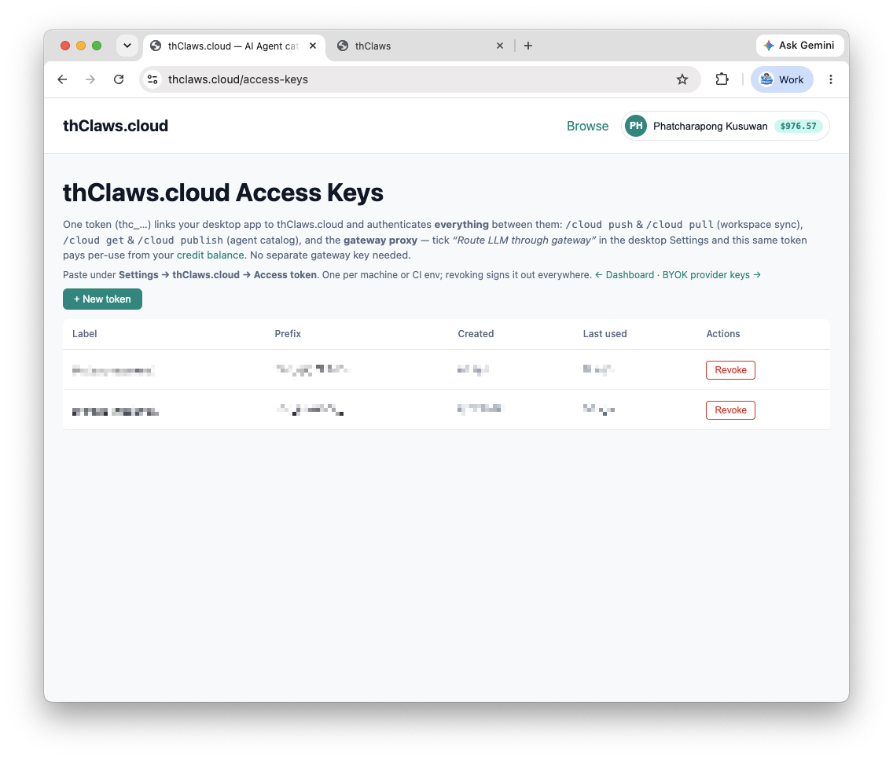<div align="center">รูปที่ 5-4 — Access Token </div>

---

## 4. Credits & Billing System (ระบบเครดิตและการเติมเงิน)

ระบบเครดิตของ thClaws.cloud ใช้รูปแบบ **Pay-per-use (จ่ายตามการใช้งานจริง)** — เข้าถึงและเรียกใช้งานโมเดล AI ชั้นนำทั้งหมดผ่าน Gateway ได้โดยไม่ต้องผูกบัตรเครดิตแยกตามผู้ให้บริการแต่ละค่าย

- **การตัดเครดิตตามจริง:** ทุกครั้งที่มีการส่งคำสั่งประมวลผล (Prompt / API Calls) ผ่าน thClaws Gateway ระบบจะหักเงินจากยอดคงเหลือ (Balance) ในกระเป๋าเครดิตของคุณทันทีตามปริมาณการใช้งานจริง
- **Model Tier:** ระบบแบ่งระดับโมเดลการใช้งาน (เช่น *Starter*) เป็นตัวกำหนดว่าบัญชีของคุณเลือกเรียกใช้ AI Model รุ่นใดได้บ้างผ่าน Gateway

**การเติมเงินและการได้รับโบนัส (Top Up & Bonus):** แพ็กเกจที่ใหญ่ขึ้นจะได้รับเครดิตโบนัสพิเศษเพิ่มเติม:

| แพ็กเกจ | รับเครดิต | โบนัส |
|--------|-----------|-------|
| $5 | 500¢ ($5.00) | — |
| $20 | 2,100¢ ($21.00) | +5% |
| $100 | 11,500¢ ($115.00) | +15% |

**การใช้โค้ดส่วนลด/ส่วนเติมเงิน (Redeem Code):** หากมี Promo Code หรือโค้ดเติมเงินจากกิจกรรม/โปรโมชัน นำมากรอกในช่อง **"Have a code? Redeem"** เพื่อแลกรับเครดิตเข้าสู่บัญชีได้ทันที

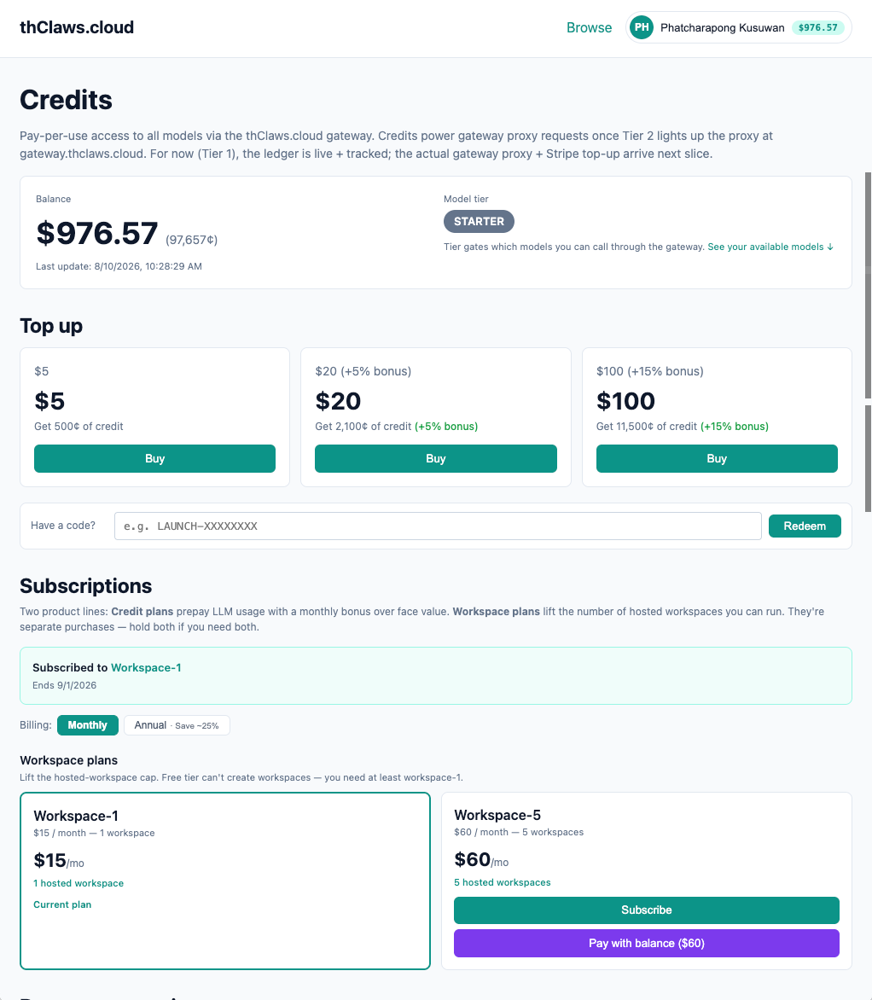<div align="center">รูปที่ 5-5 — credits & workspace price </div>

---

## 5. Workspace & Subscriptions (พื้นที่ทำงานและการสมัครสมาชิก)

ระบบสมาชิกของ thClaws.cloud แยกออกเป็น **2 ผลิตภัณฑ์หลัก** — สมัครใช้งานทั้งสองแบบควบคู่กันได้:

- **Credit Plans:** ซื้อ/เติมเครดิตล่วงหน้าเพื่อใช้ประมวลผล LLM ผ่าน Gateway (พร้อมโบนัสพิเศษตามแพ็กเกจ)
- **Workspace Plans:** ขยายขีดจำกัดจำนวนพื้นที่ทำงานบนคลาวด์ (Hosted Workspaces) ที่สร้างและบริหารจัดการได้

**เงื่อนไขการใช้งาน:**
- **Free Tier:** ไม่สามารถสร้าง Hosted Workspace ได้ — ต้องอัปเกรดเป็นแพ็กเกจอย่างน้อย **Workspace-1** ขึ้นไป
- **รอบการชำระเงิน:** รายเดือน (Monthly) หรือรายปี (Annual) — รายปีได้ส่วนลดสูงสุด **~25%**
- **การชำระด้วยเครดิต:** กดสมัครและชำระค่าสมาชิก Workspace Plan ได้โดยตรงจากยอดเงินคงเหลือในกระเป๋าเครดิต (Pay with balance)

| แพ็กเกจ | ราคา (ต่อเดือน) | ขีดจำกัด Hosted Workspace | เหมาะสำหรับ |
|---------|----------------|---------------------------|-------------|
| Workspace-1 | $15/เดือน | 1 Workspace | ผู้ใช้งานทั่วไปที่ต้องการ Workspace หลักสำหรับทำงานส่วนตัว |
| Workspace-5 | $60/เดือน | 5 Workspaces | ผู้ใช้ระดับ Advanced หรือทีมขนาดเล็กที่ต้องแยกโปรเจกต์ออกจากกัน |

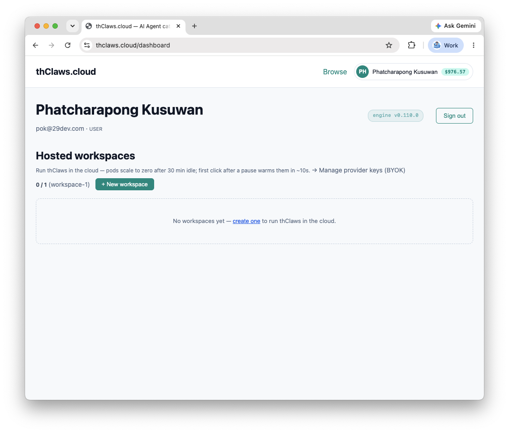<div align="center">รูปที่ 5-6 — hosted workspaces </div>

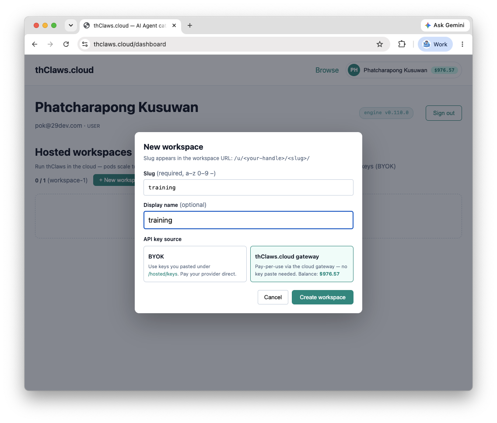<div align="center">รูปที่ 5-7 — New workspace</div>

> 📷 **รูปที่ 5-7 — หน้าเลือกแพ็กเกจ Workspace Plans** *(screenshot: หน้าเว็บแสดง Workspace-1 $15 / Workspace-5 $60 พร้อมปุ่มสมัครรายเดือน/รายปี — แทรกทีหลัง)*

ระบบแสดงรายละเอียดแพ็กเกจปัจจุบันที่หน้า **Dashboard** เช่น:

- **แพ็กเกจปัจจุบัน:** Workspace-1 (รองรับ 1 Hosted Workspace)
- **วันหมดอายุรอบปัจจุบัน:** day month year (Ends dd/mm/yyyy)

---

## 6. Access Keys (กุญแจเข้าถึงระบบ)

**thClaws Access Key** (รหัสที่ขึ้นต้นด้วย `thc_…`) คือ **Access Token เดียวจบ (All-in-One Token)** — เชื่อมต่อแอปพลิเคชันบนเดสก์ท็อปของคุณเข้ากับระบบคลาวด์ พร้อมยืนยันตัวตนความปลอดภัยทุกบริการในรหัสเดียว โดยไม่ต้องใช้ API Key หลายใบให้ยุ่งยาก

### 6.1 ขอบเขตการทำงานของ Access Key

รหัสเดียวนี้รองรับการทำงานหลักทั้งหมดในระบบ thClaws:

- **การซิงก์พื้นที่ทำงาน (Workspace Sync):** รับรองสิทธิ์อัปโหลด/ดึงข้อมูลงาน (`/cloud push` และ `/cloud pull`)
- **การจัดการคลังเอเจนต์ (Agent Catalog):** ดาวน์โหลดและเผยแพร่ตัวช่วย AI (`/cloud get` และ `/cloud publish`)
- **การเชื่อมต่อ LLM Gateway Proxy:** เพียงติ๊กเปิดตัวเลือก **"Route LLM through gateway"** ในหน้า Settings ของเดสก์ท็อปแอป ระบบจะส่งคำสั่งประมวลผล AI ผ่าน Gateway และหักค่าบริการตามจริง (Pay-per-use) จากกระเป๋าเครดิตของคุณทันที — ไม่ต้องตั้งค่า Gateway Key แยกต่างหาก

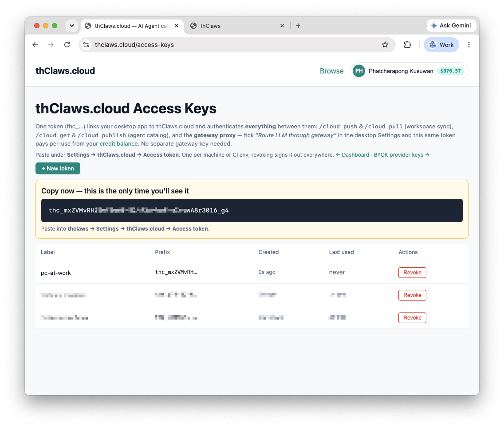<div align="center">รูปที่ 5-8 — Create new token </div>

### 6.2 วิธีนำไปใช้งานบน Desktop App (Quick Setup)

1. กดปุ่ม **`+ New Token`** บนหน้า Dashboard เพื่อสร้างรหัสใหม่
2. คัดลอกรหัส **Access Token** (`thc_…`) ที่ได้
3. นำไปวางในแอปพลิเคชันเดสก์ท็อป โดยไปที่เมนู:

```
Settings → API Key → thClaws.cloud (CLI TOKEN)
```

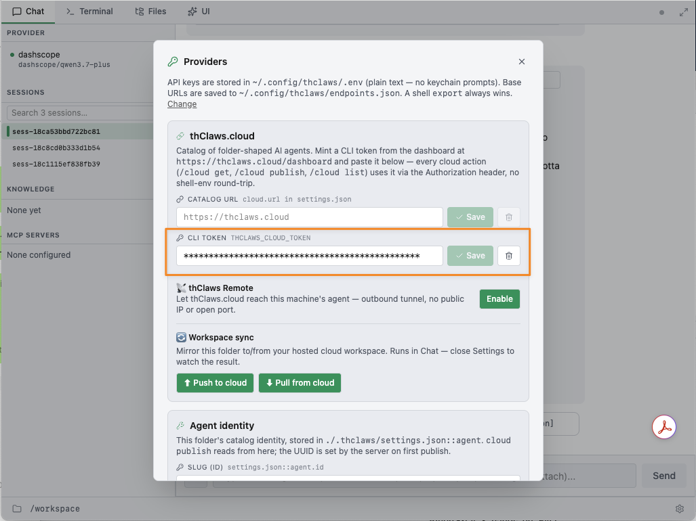<div align="center">รูปที่ 5-8-1 — หน้าตั้งค่า Access Key ใน Desktop App </div>

> 🔐 **ความปลอดภัย:** แนะนำให้ใช้ **1 Token ต่อ 1 เครื่องคอมพิวเตอร์** (หรือ 1 CI Environment) — หากพบว่ามีการสร้างจาก dashboard ในปริมาณมากเกินไป ระบบจะจำกัดการสร้าง token

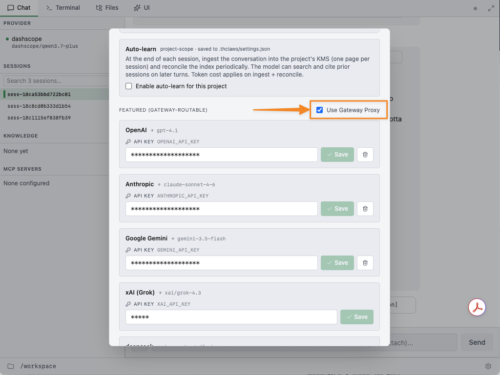<div align="center">รูปที่ 5-8-2 — ตั้งค่าเพื่อใช้ Gateway Proxy </div>


### 6.3 การบริหารจัดการ Access Key

- **การยกเลิกรหัส (Revoke):** หากรหัสหลุดรอด หรือไม่ได้ใช้งานเครื่องนั้นแล้ว กดสั่งยกเลิกรหัสจากหน้า Dashboard ได้ทันที — เครื่องนั้นจะหลุดจากการเชื่อมต่อ (Sign out) ออกจากระบบคลาวด์ทุกบริการทันที
- **ทางเลือก BYOK (Bring Your Own Key):** หากต้องการใช้ API Key ส่วนตัวจากค่าย AI โดยตรง (เช่น OpenAI หรือ Anthropic) สามารถสลับไปตั้งค่าผ่านลิงก์ **BYOK provider keys** ได้เช่นกัน

---

## 7. การใช้งาน Hosted Workspace (พื้นที่ทำงานบนคลาวด์)

**Hosted Workspaces** คือบริการรันระบบ **thClaws บนคลาวด์** โดยไม่ต้องเปิดคอมพิวเตอร์ทิ้งไว้ — ประมวลผล สั่งงาน Agent และเข้าถึงพื้นที่ทำงานได้จากทุกที่ทุกเวลา

### 7.1 Auto-Scaling & Idle Behavior

- **การประหยัดทรัพยากร (Scale to Zero):** หากไม่มีการใช้งานติดต่อกันเกิน **30 นาที** ระบบ Pod บนคลาวด์จะเข้าสู่โหมดพัก (Idle) และสเกลทรัพยากรลงเป็นศูนย์โดยอัตโนมัติเพื่อประหยัดพลังงาน
- **การเริ่มทำงานใหม่ (Warm-up Time):** เมื่อระบบอยู่ในโหมดพัก การกดใช้งานครั้งแรกจะใช้เวลาปลุกระบบ (Warm-up) กลับมาพร้อมทำงานเต็มรูปแบบในเวลาประมาณ **~10 วินาที**

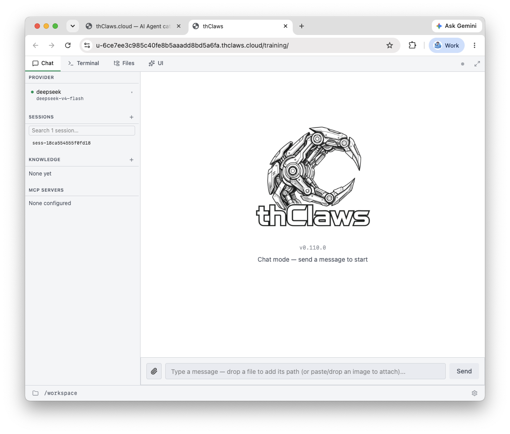<div align="center">รูปที่ 5-9 — Open  workspace</div>

---

## ลงมือทำเอง

- [ ] เปิด https://thclaws.cloud และระบุ **3 องค์ประกอบ** (AI Agents Library / Hosted Workspace / AI Model Gateway) ให้ได้
- [ ] เช็กสถานะบัญชีของตัวเอง: สมัครแล้วหรือยัง / อยู่ใน close-beta หรือได้รับ invite แล้ว
- [ ] เปิดหน้า Dashboard ดู **ยอดเครดิต (Balance)** + แพ็กเกจ Workspace ปัจจุบัน
- [ ] สร้าง **Access Key** (`+ New Token`) แล้ววางที่ Settings → API Key → **thClaws.cloud (CLI TOKEN)**
- [ ] (ระดับสูง) ติ๊ก **"Route LLM through gateway"** แล้วลองส่งคำสั่ง — ดูว่าเครดิตถูกหักตามจริง (Pay-per-use)
- [ ] (ระดับสูง) สร้าง Hosted Workspace (ถ้าแพ็กเกจรองรับ) ลองรัน Agent บนคลาวด์ แล้วสังเกต idle → warm-up ~10 วินาที

---

## ตรวจความเข้าใจ (เช็กก่อนขึ้นบทถัดไป)

**1.** thClaws.cloud มี 3 องค์ประกอบหลักอะไรบ้าง?
- ก. AI Agents Library, Hosted Workspace, AI Model Gateway
- ข. Chat, Email, Calendar
- ค. Model, Session, Memory
- ง. Browser, File, Terminal

**2.** ระบบเครดิตของ thClaws.cloud เป็นแบบใด?
- ก. จ่ายรายเดือนเหมาจ่ายเท่ากันทุกเดือน
- ข. Pay-per-use — หักจากกระเป๋าเครดิตตามการใช้งานจริงผ่าน Gateway
- ค. ฟรีตลอด ไม่มีค่าใช้จ่าย
- ง. จ่ายต่อไฟล์ที่สร้าง

**3.** ผู้ใช้ Free Tier ใช้อะไรไม่ได้?
- ก. ใช้ `/cloud get` ดาวน์โหลด Agent
- ข. สร้าง Hosted Workspace (ต้องอัปเกรดเป็น Workspace-1 ขึ้นไป)
- ค. ใช้ AI Model Gateway
- ง. สร้าง Access Key

**4.** Access Key (`thc_…`) ของ thClaws.cloud ทำอะไรได้บ้าง?
- ก. ใช้เป็นรหัสเดียว (All-in-One) สำหรับ workspace sync, agent catalog และ LLM gateway
- ข. ใช้เป็นรหัส Wi-Fi
- ค. ใช้แทนบัตรประชาชน
- ง. ใช้ได้เฉพาะการอ่านข่าว

---

<details><summary>เฉลย</summary>

- **ข้อ 1:** ก — 3 องค์ประกอบ: AI Agents Library + Hosted Workspace + AI Model Gateway
- **ข้อ 2:** ข — Pay-per-use หักตามการใช้งานจริงจากกระเป๋าเครดิต
- **ข้อ 3:** ข — Free Tier สร้าง Hosted Workspace ไม่ได้ ต้องมีแพ็กเกจ Workspace-1 ขึ้นไป
- **ข้อ 4:** ก — All-in-One Token: workspace sync + agent catalog + LLM gateway proxy

ผ่านทุกข้อ → ขึ้นบท 6 (บทสุดท้าย) ได้เลย

</details>

---

## ปัญหาที่พบบ่อย / คำถามที่คนเริ่มต้นมักถาม

| คำถาม | คำตอบ |
|--------|-------|
| "สมัคร thClaws.cloud ยังไง" | email / Google Account / Microsoft Copilot — แต่ปัจจุบันเป็น **close-beta** ต้องติดต่อ admin แล้วรอ email invited |
| "ต้องจ่ายยังไง" | เติมเครดิตล่วงหน้า (Credit Plans) — ใช้เท่าไหร่หักเท่านั้น (Pay-per-use ผ่าน Gateway) |
| "ฟรีเทียร์สร้าง workspace ได้ไหม" | ไม่ได้ — ต้องอัปเกรดเป็น Workspace-1 ($15/เดือน) ขึ้นไป |
| "token ทำอะไรบ้าง" | รหัสเดียวจบ: workspace sync, catalog, gateway — ตั้งที่ Settings → API Key → thClaws.cloud (CLI TOKEN) |
| "ลืม revoke token" | เข้า Dashboard → กด Revoke — เครื่องนั้นถูก sign out จากทุกบริการทันที |
| "hosted workspace ค้างนานไม่ใช้" | ระบบ scale-to-zero หลังไม่ใช้งาน 30 นาที — กลับมาใช้งานใช้เวลาปลุก ~10 วินาที |

**ข้อผิดพลาดที่คนเริ่มต้นมักทำ:**
- ❌ เข้าใจว่า thClaws.cloud แทนที่การทำงานบนเครื่อง — จริงๆ เป็นของเสริม (additive) สลับ/แชร์ระหว่าง desktop ↔ cloud ได้
- ❌ ใช้ token เดียวหลายเครื่อง — แนะนำ 1 token ต่อ 1 สภาพแวดล้อม
- ❌ ไม่ตรวจยอดเครดิต — Pay-per-use หักตามการใช้งานจริง ควรตรวจ Balance ที่ Dashboard เป็นระยะ

---

## สรุปบท

| หัวข้อ | สาระ |
|--------|------|
| thClaws.cloud | เว็บไซต์บริการ AI Agents + สลับ workspace desktop ↔ cloud + AI Models Gateway |
| 3 องค์ประกอบ | AI Agents Library (`/cloud get`, `/cloud publish`) · Hosted Workspace (`/cloud push`/`/cloud pull`) · AI Model Gateway |
| สมัคร | email / Google / Microsoft Copilot — ปัจจุบัน close-beta ต้องติดต่อ admin |
| จ่าย | Pay-per-use ผ่านเครดิต (เติม $5/$20/$100 รับโบนัส) |
| แพ็กเกจ | Workspace-1 $15 (1 ws) · Workspace-5 $60 (5 ws) — Free Tier สร้าง hosted workspace ไม่ได้ |
| Access Key | `thc_…` รหัสเดียวจบ: sync + catalog + gateway — ตั้งที่ Settings → API Key |
| Hosted Workspace | รัน agent บนคลาวด์ — idle 30 นาที → scale-to-zero, warm-up ~10 วินาที |

> **ประโยคส่งต่อ:** รู้จักบริการคลาวด์ครบแล้ว — บทสุดท้าย (บทที่ 6) จะทบทวนทั้งหมด, ให้งานปฏิบัติรวม, แบบตรวจความเข้าใจทั้งเล่ม และแผนนำไปใช้จริง
