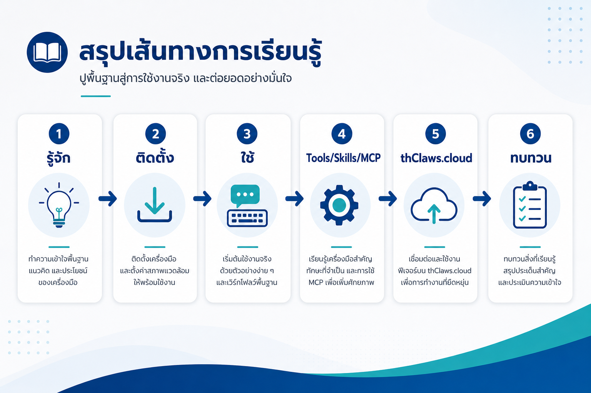

# บทที่ 6 — ทบทวนทั้งเล่ม, งานปฏิบัติรวม และก้าวต่อไป

> ⏱ อ่าน ~15 นาที + ทำงานปฏิบัติ ~30 นาที
> 🎯 เป้าหมายบทนี้: ทบทวนทุกอย่างที่เรียนมา, ลงมือทำงานจริงชิ้นหนึ่งจนได้ผลลัพธ์, ตรวจความเข้าใจทั้งเล่ม, และวางแผนนำไปใช้ในงานประจำวัน

---

## สิ่งที่คุณจะได้จากบทนี้

- สรุปภาพรวมทั้งเล่ม (หนึ่งบท = หนึ่งใจความ)
- เช็กลิสต์คำสั่งที่ใช้บ่อย (Cheat Sheet) สำหรับพกใช้
- งานปฏิบัติชิ้นสุดท้าย: ใช้ thClaws สร้างผลลัพธ์จริง + วางแผนงานประจำวัน
- แบบตรวจความเข้าใจทั้งเล่ม (ทำเอง + เฉลย)
- เส้นทางไปต่อหลังจากนี้

---

## 1. สรุปภาพรวมทั้งเล่ม (บทต่อบท)

| บท | สาระที่ได้ |
|-----|-----------|
| บท 1 | thClaws = AI Agent แบบ local-first; Chat ตอบ / Agent ทำงาน |
| บท 2 | ติดตั้ง + ตั้ง Qwen Key + instruction (folder = ตัวตน agent) |
| บท 3 | 3 โหมด (GUI/CLI/One-shot), working directory, session, คำสั่งแรก |
| บท 4 | Tools (มือ) / Skills (วิธีทำ) / MCP (สายเชื่อมต่อภายนอก) |
| บท 5 | thClaws.cloud = บริการคลาวด์ (คลัง agent + hosted workspace + model gateway); Access Key ตั้งค่าได้ |

**เส้นทางที่คุณเดินมา:** รู้จัก → ติดตั้ง → ใช้ → ต่อยอด (Tools/Skills/MCP) → บริการคลาวด์ (cloud) → (บทนี้) ทบทวนและวางแผน



*รูปที่ 6-1 — เส้นทางทั้งหมดที่ผ่านมา: รู้จัก → ติดตั้ง → ใช้ → Tools/Skills/MCP → cloud → ทบทวน*

---

## 2. เช็กลิสต์คำสั่งที่ใช้บ่อย (Cheat Sheet)

| คำสั่ง | ทำอะไร |
|--------|--------|
| `thclaws` | เปิด Desktop GUI |
| `thclaws --cli` | เปิด CLI REPL |
| `thclaws -p "คำสั่ง"` | สั่งแบบ One-shot |
| `/new` | เริ่ม session ใหม่ |
| `/model qwen-plus` | สลับโมเดล |
| `/provider dashscope` | สลับ provider |
| `/help` | ดูคำสั่งทั้งหมด |
| `/skills` | ดู skills ที่ติดตั้งในเครื่อง |
| `/skill marketplace` | ดู skill ที่มีให้ติดตั้งจาก marketplace |
| `/skill install <name>` | ติดตั้ง skill จาก marketplace (เช่น `/skill install frontend-design`) |
| `/cloud get <slug>` | ดาวน์โหลด Agent จากคลังกลาง (AI Agents Library) |
| `/cloud publish` | เผยแพร่/แชร์ agent ขึ้นคลัง |
| `/cloud push` | ซิงก์ workspace ขึ้น cloud (สำรอง/ทำงานต่อ) |
| `/cloud pull` | ดึง workspace ล่าสุดจาก cloud ลงเครื่อง |

---

## 3. งานปฏิบัติชิ้นสุดท้าย (ทำจริง ~30 นาที)

โจทย์มี 2 ส่วน — ทำทั้ง 2 แล้วคุณจะได้ "ใบรับรอง" ของตัวเองว่าใช้ thClaws เป็นจริง:

### ส่วนที่ 1 — สร้างผลลัพธ์จริง 1 อย่าง

ใช้ไฟล์ตัวอย่างในโฟลเดอร์ `samples/` (หรือไฟล์ของคุณเอง) เลือกทำ 1 ข้อ:

**ตัวเลือก ก — สรุปเอกสาร:**
```
อ่าน company-policy.pdf แล้วสรุปเป็น bullet 5 ข้อ
เขียนผลลัพธ์ลงไฟล์ policy-summary.md
```

> 📷 **รูปที่ 6-2 — ตัวอย่างผลลัพธ์เป้าหมาย `policy-summary.md`** *(screenshot: ไฟล์สรุป bullet 5 ข้อ เปิดจาก working directory — แทรกทีหลัง)*

**ตัวเลือก ข — สร้าง Excel จากข้อมูล:**
```
อ่าน monthly-sales.csv แล้วสร้างไฟล์ Excel ชื่อ sales-report.xlsx
จัดกลุ่มยอดขายแยกตามสินค้า และสรุปยอดรวมแต่ละชนิด
```

> 📷 **รูปที่ 6-3 — ตัวอย่างผลลัพธ์เป้าหมาย `sales-report.xlsx`** *(screenshot: สเปรดชีตที่เปิดแล้วเห็นยอดแยกสินค้า + ยอดรวม — แทรกทีหลัง)*

**ตัวเลือก ค — รวมและจัดรูปแบบ:**
```
อ่าน customer-contacts.csv กับ meeting_notes.txt
แล้วสร้างไฟล์สรุปงานเดียวชื่อ work-summary.md ขึ้นมา
```

**เกณฑ์ว่าผ่าน:**
- เห็น `[tool: …]` ในคำตอบ (Agent ลงมือจริง ไม่ใช่แค่ตอบ)
- prompt ชัดเจน มีขั้นตอน
- ผลลัพธ์เป็น**ไฟล์จริง**ที่เปิดดูได้ใน working directory

### ส่วนที่ 2 — วางแผนงานประจำวัน 1 อย่าง

เขียนลงไฟล์ `my-plan.md` ตามหัวข้อนี้:

```
งานที่อยากให้ thClaws ช่วย: ________________________________
ขั้นตอนโดยประมาณ: ________________________________
Tool / Skill / MCP ที่เกี่ยวข้อง: ________________________________
โมเดลที่เหมาะ (เร็ว/คุณภาพ): ________________________________
```

**ตัวอย่าง (เพื่อให้เห็นรูปแบบ):**
```
งาน: สรุปบันทึกประชุมทุกวันจันทร์
ขั้นตอน: วาง transcript ในโฟลเดอร์ → สั่ง "สรุปเป็น bullet + แยก action items"
Tool: Read, Write | โมเดล: qwen-plus (งานทั่วไปประจำ)
```

---

## 4. แบบตรวจความเข้าใจทั้งเล่ม (ทำเองก่อน ดูเฉลยท้าย)

ทดสอบความรู้ครบทั้ง 5 บท — ทำคะแนน ≥ 11/15 จึงถือว่าผ่าน:

**บท 1 (รู้จัก thClaws):**
- **Q1.** ข้อใดคือความต่างหลักระหว่าง Chat AI กับ thClaws? (ก ตอบเป็นข้อความ / ข **ตอบเป็นข้อความ, Agent ลงมือผ่าน Tools จนได้ผลลัพธ์จริง** / ค ต้องจ่ายเสมอ / ง ไม่ต่าง)
- **Q2.** "folder = agent" แปลว่าอะไร? (ก **แต่ละโฟลเดอร์ทำงาน = ผู้ช่วยหนึ่งตัวที่มีตัวตน/คำสั่งของตัวเอง** / ข ต้องสร้างโฟลเดอร์ทุกครั้ง / ค เก็บเฉพาะรูปภาพ / ง ไม่เกี่ยวข้อง)

**บท 2 (ติดตั้ง & ตั้งค่า):**
- **Q3.** Qwen API Key ควรเก็บไว้ที่ไหน? (ก ฝังในโค้ด / ข **OS Keychain (หลัก) + .env (สำรอง)** / ค แชร์ในไลน์ / ง โพสต์ GitHub)
- **Q4.** การเลือกโมเดลขึ้นกับอะไร? (ก ความลับข้อมูล / ข **ความสามารถของโมเดล (เร็ว/คุ้ม/คุณภาพ) ที่ตรงกับงาน** / ค สี UI / ง วันเกิด)
- **Q5.** คำสั่งสลับ provider เป็น DashScope? (ก **`/provider dashscope`** / ข `/delete provider` / ค `/key qwen` / ง `/install dashscope`)

**บท 3 (เริ่มใช้งานจริง):**
- **Q6.** thClaws ใช้งานได้กี่รูปแบบ? (ก เฉพาะ GUI / ข 2 รูปแบบ / ค **3 รูปแบบ (GUI/CLI/One-shot)** / ง 5 รูปแบบ)
- **Q7.** Session คืออะไร? (ก **หนึ่งงาน/บทสนทนาชุดหนึ่ง แยกเรื่องกันได้** / ข ใบเสร็จ / ค ชนิดโมเดล / ง โฟลเดอร์ระบบ)
- **Q8.** เมื่อ Agent ขอทำงาน คุณควร? (ก Allow all ทันที / ข **ตรวจ permission ก่อน แล้วอนุญาตเฉพาะที่เข้าใจ** / ค ไม่ยอมเลย / ง ปิดโปรแกรม)

**บท 4 (Tools/Skills/MCP):**
- **Q9.** "Skill" คืออะไร? (ก **วิธีทำงานแบบสำเร็จรูป (workflow + trigger)** / ข เกมฝึกทักษะ / ค ชนิดแป้นพิมพ์ / ง สีเทอร์มินัล)
- **Q10.** MCP ใช้ทำอะไร? (ก **เชื่อมต่อบริการภายนอก (Drive, GitHub, DB)** / ข เพิ่มความเร็วเน็ต / ค บีบอัดไฟล์ / ง แปลภาษา)
- **Q11.** จะรู้ได้อย่างไรว่า Agent ลงมือใช้ tools จริง? (ก **เห็นไฟล์สร้างจริง + `[tool: …]`** / ข รู้ไม่ได้ / ค ต้องเปิดกล้อง / ง เดาจากเสียง)

**บท 5 (thClaws.cloud):**
- **Q12.** thClaws.cloud มี 3 องค์ประกอบหลักอะไรบ้าง? (ก **AI Agents Library, Hosted Workspace, AI Model Gateway** / ข Chat, Email, Calendar / ค Model, Session, Memory / ง Browser, File, Terminal)
- **Q13.** ระบบเครดิต (Credits) ของ thClaws.cloud เป็นแบบใด? (ก จ่ายรายเดือนเหมาจ่าย / ข **Pay-per-use — หักจากกระเป๋าเครดิตตามการใช้งานจริงผ่าน Gateway** / ค ฟรีตลอด / ง จ่ายต่อไฟล์)
- **Q14.** ผู้ใช้ Free Tier ใช้อะไรไม่ได้? (ก `/cloud get` ดาวน์โหลด Agent / ข **สร้าง Hosted Workspace (ต้องอัปเกรดเป็น Workspace-1 ขึ้นไป)** / ค ใช้ AI Model Gateway / ง สร้าง Access Key)

**บท 3 (เพิ่มเติม):**
- **Q15.** thClaws เปิด CLI REPL ด้วยคำสั่งใด? (ก **`thclaws --cli`** / ข `thclaws --web` / ค `thclaws -r` / ง `thclaws start`)

---

<details><summary>เฉลยทั้งเล่ม (+ เหตุผลสั้น)</summary>

| ข้อ | เฉลย | เหตุผลสั้น |
|----|------|-----------|
| Q1 | **ข** | Chat ตอบ / Agent ลงมือผ่าน tools |
| Q2 | **ก** | โฟลเดอร์ทำงานหนึ่ง = agent หนึ่งตัว (AGENTS.md) |
| Q3 | **ข** | Key เก็บใน Keychain หลัก + .env สำรอง |
| Q4 | **ข** | เลือกตามความสามารถของโมเดล ไม่ใช่ความลับ |
| Q5 | **ก** | `/provider dashscope` |
| Q6 | **ค** | GUI / CLI / One-shot |
| Q7 | **ก** | หนึ่งงาน = หนึ่ง session |
| Q8 | **ข** | ตรวจ permission ก่อนอนุญาต |
| Q9 | **ก** | Skill = workflow + trigger |
| Q10 | **ก** | MCP = สายเชื่อมต่อบริการภายนอก |
| Q11 | **ก** | เห็นไฟล์จริง + `[tool: …]` |
| Q12 | **ก** | 3 องค์ประกอบ: Library + Hosted Workspace + Gateway |
| Q13 | **ข** | Pay-per-use หักตามการใช้งานจริงจากกระเป๋าเครดิต |
| Q14 | **ข** | Free Tier สร้าง hosted workspace ไม่ได้ ต้องอัปเกรด |
| Q15 | **ก** | `thclaws --cli` เปิด CLI REPL |

**เกณฑ์ผ่าน:** ≥ 11/15 (≥ ~70%) — ถ้าต่ำกว่านี้ ให้อ่านย้อนบทที่ตอบผิดอีกครั้ง

</details>

---

## 5. เกณฑ์ประเมินงานปฏิบัติชิ้นสุดท้ายด้วยตัวเอง

ใช้เช็กว่างานที่คุณทำใน §3 ดีพอหรือยัง:

| เกณฑ์ | คำถามเช็คตัวเอง | ผ่านไหม |
|-------|-----------------|---------|
| R1. ผลลัพธ์เป็น "งานจริง" | มีไฟล์จริงสร้างขึ้น และเห็น `[tool: …]` / ใช้หลาย Tool | ☐ |
| R2. Prompt ชัด + มีขั้นตอน | Prompt เฉพาะเจาะจง แยกขั้นตอนชัดเจน | ☐ |
| R3. เลือกโมเดลถูกหลัก | อธิบายได้ว่าทำไมเลือกโมเดลนี้ตามความสามารถของงาน | ☐ |
| R4. แผนงานประจำวัน | ครบ: งาน / ขั้นตอน / Tool-Skill-MCP / โมเดล | ☐ |
| R5. ความถูกต้องของผลลัพธ์ | เปิดไฟล์แล้วตรวจเนื้อหาถูกต้อง | ☐ |

ผ่าน 4–5 ข้อ = พร้อมใช้จริง

---

## 6. เส้นทางไปต่อ (หลังอ่านจบ)

- **ใช้จริง / รายวัน:** เริ่มจากงานซ้ำ 1 อย่างที่คุณเลือกในบทที่ 1 → สร้างโฟลเดอร์/session สำหรับมัน → สั่งให้ thClaws ทำตามขั้นตอนที่คุณเขียน
- **เรียนต่อ:** อยากรู้ลึกเรื่องไหน อ่าน `user-manual-th` ของ thClaws (Sessions, Skills, MCP, cloud)
- **แชร์ทีม:** publish skill/agent ขึ้นคลังด้วย `/cloud publish`
- **งานลับ / offline:** ใช้ Ollama (`ollama pull qwen`) — รันในเครื่อง ไม่ใช้เน็ต ไม่พึ่ง Key

---

## 7. หมายเหตุสำคัญ (สิ่งที่ต้องจำไปตลอด)

- **ตรวจผลลัพธ์เสมอ** — AI ยังมีข้อมูลลวง (hallucination) อย่าเชื่อผลลัพธ์โดยไม่ตรวจ
- **สั่งให้ชัดเจน** — prompt ยิ่งเฉพาะเจาะจง ผลยิ่งแม่น
- **Key / token ห้ามแชร์** — ปกป้องเหมือนรหัสผ่าน; Access Key `thc_…` ยกเลิก (Revoke) ได้ที่ Dashboard
- **หนึ่งงาน = หนึ่ง session** — เปลี่ยนเรื่อง เริ่ม session ใหม่
- **อย่า "Allow all" มั่ว** — ตรวจ permission ก่อนกดอนุญาตเสมอ

---

> **ประโยคปิดของหนังสือ:** วันนี้คุณได้ก้าวจาก "ถาม Chat AI" ไปสู่ "ตั้งผู้ช่วยที่ทำงานจริงบนเครื่องของตัวเอง" แล้ว — เริ่มจากงานซ้ำๆ หนึ่งอย่าง แล้วให้ thClaws ทำให้คุณเติบโตทีละงาน